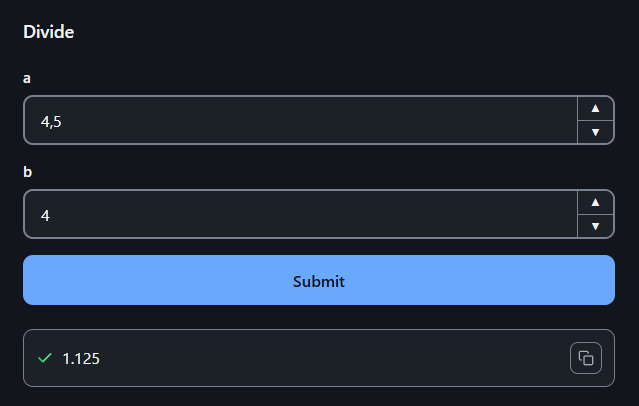
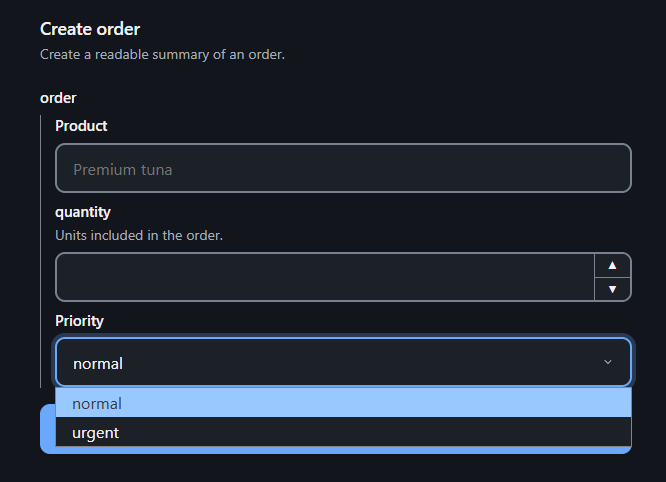
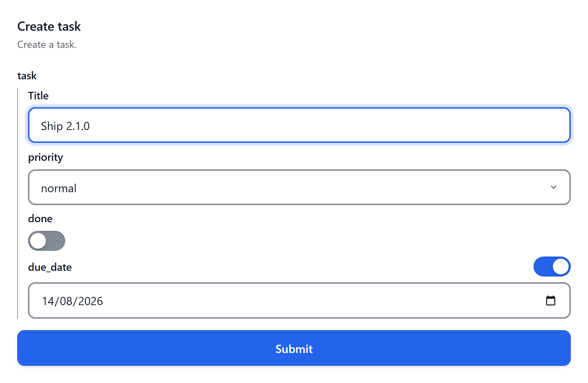
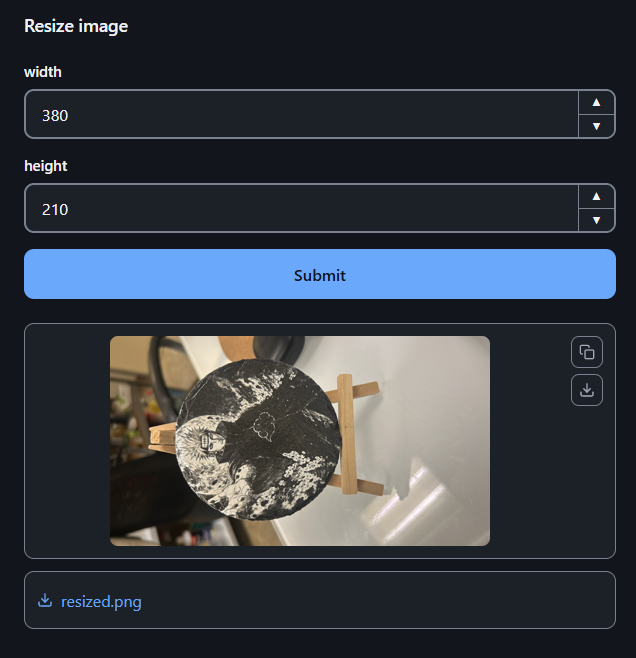
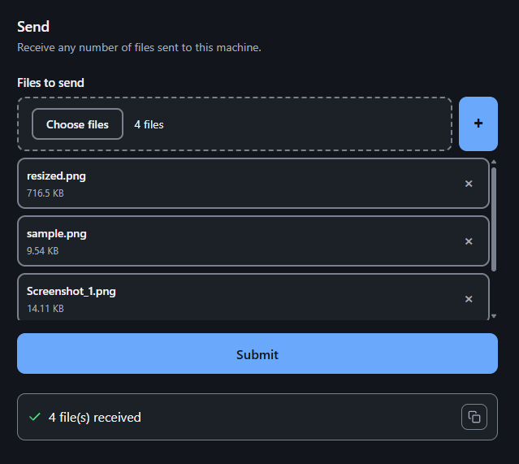
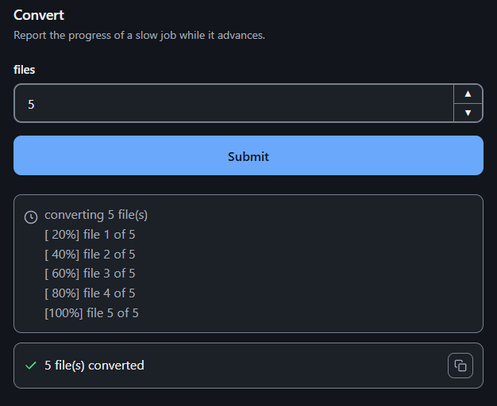
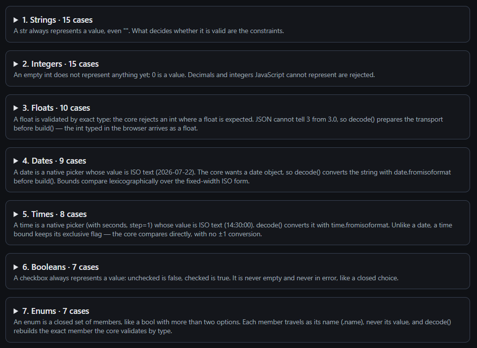

# FuncToWeb 2.6.0

[](https://pypi.org/project/func-to-web/)
[](https://pypi.org/project/func-to-web/)
[](LICENSE)

**Turn typed Python functions into web interfaces.**

Write a normal Python function with type hints. FuncToWeb turns it into a ready-to-use web form, validates its input and runs it through HTTP.

No models. No duplicated schemas. No manually written forms.

```python
from func_to_web import run

def divide(a: float, b: float) -> float:
    return a / b  # Any exception becomes a clean error in the page and the API

run(divide)
```



With `run(divide)` you already have a web app at <http://127.0.0.1:8000>.

```bash
pip install func-to-web
```

## The same function is an API

```bash
curl -X POST -H "Content-Type: application/json" \
  -d '{"a": 10, "b": 2}' \
  http://127.0.0.1:8000/divide/invoke

# {"result": {"type": "text", "value": "5.0"}}
```

The form and the endpoint are the same definition, so an error comes out just as
clean over HTTP: `b = 0` answers
`{"error": "ZeroDivisionError: float division by zero"}`.

→ [http.md](docs/http.md)

## Documented for humans and agents

`GET /doc` is the published contract of the space, in plain text.

```text
=== FuncToWeb ===

Every path is relative to the prefix this application is mounted on; replace
<base_url> with it.

Functions:
  /divide

=== Calling ===
...
=== Plans ===

--- /divide ---
```

`Calling` explains the request and the envelope; `Plans` carries the complete
contract of every function, with its types, defaults and constraints. An agent
connecting to a mounted space reads it and learns how to call each function.

→ [api-docs.md](docs/api-docs.md)

## FastAPI integration

`app_of()` returns a mountable Starlette/ASGI application; the host keeps
control of authentication, routes, frontend and deployment.

```python
from fastapi import FastAPI

from func_to_web import app_of


app = FastAPI()
app.mount("/tools", app_of([divide]))
```

Everything lives under `/tools/`: the routes are relative to the mounted
prefix, so any prefix works.

→ [router.md](docs/router.md), [web-function.md](docs/web-function.md)

## Your own frontend

Your page stays yours. When it needs a "create user" form, you do not write the
form, the validation or the endpoint: you write `def create_user(...)` and open
it in a modal. `sdk.js`, the static asset the space serves, covers the rest with
a handful of plain functions for the parts every frontend would have to write
itself: calling, uploading, streaming, and opening a function's page in an
iframe or a modal.

```javascript
import { call, openModal } from "/tools/static/sdk.js";

const outputs = await call("/tools/divide", {a: 10, b: 2});

outputs[0].value;   // "5.0"

// Your page's "New user" button — form, validation and endpoint come from the Python signature
openModal("/tools/create_user", {prefill: {team: "sales"}});
```

There is no URL to assemble, no envelope to unwrap and no build step: it is a
static asset, and every function takes the URL it works on.

→ [sdk.md](docs/sdk.md)

## How it works

Your code does not change: no base classes, no decorators, no registration, no
models to declare. FuncToWeb reads the signature and builds a separate
representation from it.

```python
from dataclasses import dataclass
from typing import Annotated

from func_to_web import Choices, Description, Label, Max, Min, Placeholder


@dataclass
class Order:
    product: Annotated[str, Label("Product"), Placeholder("Premium tuna")]
    quantity: Annotated[
        int,
        Description("Units included in the order."),
        Min(1),
        Max(100),
    ]
    priority: Annotated[
        str,
        Label("Priority"),
        Choices(values=("normal", "urgent")),
    ] = "normal"


def create_order(order: Order) -> str:
    """Create a readable summary of an order."""
    return f"{order.quantity} × {order.product} ({order.priority})"
```



`Label`, `Min` and `Choices` are annotations on ordinary types: `Annotated` adds
context without touching them, so `product` is still a `str` and `quantity` an
`int`. Constraints such as `Min`, `Max` or `Choices` narrow what is accepted;
presentation metadata such as `Label`, `Description` or `Placeholder` only
changes how a field looks, and nothing is required. The form, the validation and
`/doc` all come out of that single definition, so the contract lives in one
place instead of being duplicated across the interface, the server and the
documentation.

```text
Python function
      ↓
    schema        types, constraints, defaults, arguments
      ↓
     plan         web representation of the contract
      ├── web interface
      ├── HTTP API
      └── /doc
```

## Change once, propagate everywhere

A CRUD is where duplication usually creeps in: the same fields respelled
across the create form, the edit form, the validation and the API. Here the
model is written once, and the functions only reference it:

```python
from dataclasses import dataclass
from itertools import count
from typing import Annotated, Literal

from fastapi import FastAPI

from func_to_web import Label, Max, Min, app_of

# --- the model, once -----------------------------------------------------

@dataclass
class Task:
    title: Annotated[str, Min(1), Max(80), Label("Title")]
    priority: Literal["low", "normal", "high"] = "normal"
    done: bool = False


TASKS: dict[int, Task] = {}
_ids = count(1)

# --- the three functions reference it; none respells a field -------------

def create_task(task: Task) -> str:
    """Create a task."""
    task_id = next(_ids)
    TASKS[task_id] = task
    return f"Task {task_id} created"


def edit_task(task_id: int, task: Task) -> str:
    """Edit a task."""
    if task_id not in TASKS:
        raise KeyError(f"no task {task_id}")
    TASKS[task_id] = task
    return "Task updated"


def delete_task(task_id: int) -> str:
    """Delete a task."""
    if TASKS.pop(task_id, None) is None:
        raise KeyError(f"no task {task_id}")
    return "Task deleted"


app = FastAPI()
app.mount("/tools", app_of([create_task, edit_task, delete_task]))
```

Now add a field:

```python
    due_date: date | None = None
```



That one line updates both forms (a date picker with its optional toggle),
the validation (`422` on anything that is not an ISO date or `None`), and the
contract `/doc` publishes. Nothing else is edited, because the forms, the
validation and the documentation are not written anywhere: they are read from
this definition. In the version of this CRUD where each function spells its
own parameters, the same change is four edits — and missing the one in
`edit_task` loses the date silently on every edit.

The full example, with its hand-written frontend opening these functions in
modals, is [`examples/project/todo.py`](examples/project/todo.py);
[`users.py`](examples/project/users.py) beside it adds a photo per user,
walking the whole file cycle — upload once, edit without re-uploading.

## How it compares

Gradio and Streamlit are built for demos and data apps, each with its own UI
model and its own server, and your code knows it: the function is wrapped in
an interface object, or the script becomes the app. FuncToWeb never touches
your code — no base classes, no decorators, no registration — so the same
function is imported, tested and called exactly as if the library were not
there. And it is built for internal tools mounted inside an existing FastAPI
application: they run under the host's authentication and routing, the
contract is strict and typed, and execution is an ordinary HTTP call. Where
the tool has to live, and whether your functions may know about it, usually
decides the choice. And unlike Gradio or Streamlit, it fits inside a frontend
that already exists: any function is an embeddable page, one `openModal()` away.

## Capabilities

FuncToWeb is designed for internal tools, whether you are building new ones or
extending what existing ones already do. It is listed in
[Awesome Python](https://github.com/vinta/awesome-python#admin-panels), in the
admin panels section.

* **Strict, recursive validation** — every item of a list, every field of a
  nested dataclass; the function receives fully built Python values.
  → [types.md](docs/types.md)
* **Reusable file references** — one upload, many executions: a file travels as
  a reference that stays valid in later calls. → [files.md](docs/files.md)
* **`print()` streaming** — the web interface shows what the function prints
  while it runs. → [streaming.md](docs/streaming.md)
* **Rematerialized defaults** — validated at compile time and rebuilt on every
  execution, so a mutable default is never shared between calls, without the
  classic Python trap. → [types.md](docs/types.md#defaults)

The rest comes with it: complete forms with dataclasses, lists, unions,
optionals, defaults, enums, dates, colors and files
([types.md](docs/types.md)); pages that open
[prefilled](docs/prefill.md), with selected fields hidden; results as text,
images, tables and [downloads](docs/outputs.md); execution over HTTP with
`POST /{slug}/invoke`, one request and one response ([http.md](docs/http.md));
a full [embeddable page](docs/sdk.md#embedding-a-function-page) per function;
and a [light, dark or system theme](docs/router.md#theme) applied in the initial
HTML, so the page does not flicker.

## Moving between forms

A function can return the data that **another** function in the space opens
with, by marking its return value with `OpenForm`:

```python
from pathlib import Path
from typing import Annotated

from PIL import Image

from func_to_web import Download, FileHint, OpenForm, run

ImagePath = Annotated[
    str,
    FileHint(extensions=(".png", ".jpg", ".jpeg")),
]


def resize_image(
    image: ImagePath,
    width: int,
    height: int,
) -> tuple[Image.Image, Annotated[Path, Download()]]:
    output = Path(image).with_name("resized.png")

    with Image.open(image) as source:
        resized = source.resize((width, height))

    resized.save(output)

    return resized, output


def choose_image(
    image: ImagePath,
) -> Annotated[
    dict,
    OpenForm(resize_image, hidden=("image",)),
]:
    with Image.open(image) as source:
        width, height = source.size

    return {"image": image, "width": width, "height": height}


run([choose_image, resize_image])
```



`choose_image` reads the uploaded image size and opens `resize_image` with its
current width and height already filled in. The image stays attached as hidden
context, so it is not uploaded again. The result shows the resized image and
offers the same file as a download.

`resize_image` is defined first because `OpenForm` takes the target function
itself, and that name has to exist when `choose_image` is defined.

→ [open-form.md](docs/open-form.md)

## Receiving files

```python
from typing import Annotated

from func_to_web import FileHint, Label, Min, run

AnyFile = Annotated[str, FileHint()]

Dropped = Annotated[list[AnyFile], Min(1), Label("Files to send")]


def send(files: Dropped) -> str:
    """Receive any number of files sent to this machine."""
    return f"{len(files)} file(s) received"


run(send, title="LocalSend")
```



Every file is stored before the function runs, so `files` arrives as paths to
files already on disk: a function that accepts files and does nothing else is
a working file drop.

They travel as references, never as server paths, and a reference is
immutable — store one and reuse it in later calls without uploading again. An
upload no execution ever uses expires; what your code received stays.

→ [files.md](docs/files.md), [`local_send.py`](examples/files/local_send.py)

## Examples

The examples are probably the best way to learn the library.
[`examples/`](examples/README.md) contains 81 runnable programs in 11 folders.
Each file teaches **a single capability**: you can read it in one sitting and
run it as it is. Alongside them, [`examples/project/`](examples/project/) holds
mini-apps, where several capabilities are combined into one small application.

```python
"""A progress bar is nothing more than one print per finished step."""

import time
from typing import Annotated

from func_to_web import Max, Min, run

STEP_SECONDS = 0.2


def convert(files: Annotated[int, Min(1), Max(8)] = 5) -> str:
    """Report the progress of a slow job while it advances."""
    print(f"converting {files} file(s)")

    for index in range(1, files + 1):
        time.sleep(STEP_SECONDS)
        percent = index * 100 // files
        print(f"[{percent:3d}%] file {index} of {files}")

    return f"{files} file(s) converted"


if __name__ == "__main__":
    run(convert, title="Progress")
```



That is the entire file
[`examples/streaming/progress.py`](examples/streaming/progress.py). There is no
progress API: `print()` is the API, and the interface shows the lines while the
function runs. The other folders follow the same pattern (types, validation,
files, outputs, `OpenForm`, themes, FastAPI and HTTP clients).

The whole set is about 2,800 lines, so it fits inside the context window of a
general-purpose AI: you can hand over the complete collection, or a single
folder for a specific task.

## Layers

```text
pytypehint      types, validation, defaults, argument construction
    ↓
pytypehintweb   web plan, browser widgets and transport
    ↓
FuncToWeb       routes, execution, integration and documentation
```

[`pytypehint`](https://github.com/offerrall/pytypehint) compiles the signature
into the contract of types, constraints and defaults;
[`pytypehintweb`](https://github.com/offerrall/pytypehintweb) turns that contract
into the plan the browser consumes, with its widgets and transport.

FuncToWeb does not redefine the type language and does not duplicate the
validation; it re-exports the pieces of both, so you never have to import from
the lower layers:

```python
from func_to_web import Choices, Description, Label, Max, Min, Pattern
```

The complete catalog of widgets, with the annotation that generates each
control, ships as a demo in
[`pytypehintweb`](https://github.com/offerrall/pytypehintweb):

```bash
pip install "pytypehintweb[demo]"
pytypehintweb-demo
```



Beside the stack, not under it: FuncToWeb stores nothing — a function runs and
returns. When a small app needs its rows to outlive the process,
[`pytypehintstore`](https://github.com/offerrall/pytypehintstore) persists the
same dataclasses this stack validates, in memory and shadowed by a JSON file you
can open and edit. It is optional and not a dependency:
[`examples/project/todo_stored.py`](examples/project/todo_stored.py) is the todo
mini-app with the dict swapped for a store.

→ [architecture.md](docs/architecture.md)

## Small enough to audit

Those three libraries are the whole stack: nested forms, recursive validation,
streaming, the file lifecycle and the published contract are all inside these
lines (v2.6.0, `.py`/`.js`/`.css` under `src/`).

```text
pytypehint       2,740 lines    types, validation, defaults
pytypehintweb    9,468 lines    plan, widgets, transport (includes the JS/CSS)
FuncToWeb        5,071 lines    routes, execution, storage, /doc
total           ~17,300 lines
```

Each layer can be read on its own: pytypehint is under 3,000 lines of pure
stdlib and takes an afternoon, and no layer needs the others to be understood.
The whole set also fits inside the context window of a general-purpose AI: you
can hand over an entire library, or the three of them, and ask it to review,
explain or audit them. It is not only readable by humans; it is reviewable by
machines.

Few lines means little surface to hide in: what the documentation promises can
be checked by reading the code.

The dependency tree is as small as the code. There are three direct
dependencies, and on Python 3.13 a clean install is nine packages in total,
FuncToWeb included:

```text
func-to-web
├── pytypehintweb → pytypehint
├── starlette     → anyio → idna
└── uvicorn       → click, h11
```

On Windows `click` adds `colorama`, and on Python 3.11 and 3.12 `starlette` and
`anyio` add `typing-extensions`; the whole set stays under 750 kB of wheels.
There is no pydantic, no template engine and no build step: Starlette and
Uvicorn carry the HTTP, and the two pytypehint layers carry the contract.
Everything else in the list is what those four need to run. `pip install
func-to-web && pip freeze` in an empty virtualenv prints exactly this.

## Documentation

[docs/index.md](docs/index.md) is the complete index, organized by what you
want to do, and the technical reference for everything the examples show in
practice.

## Status

2.6.0 is a stable release: the public API is the one described in
[`docs/`](docs/index.md), and the known limitations are listed in
[limitations.md](docs/limitations.md).

If you are coming from 1.6, the migration guide is in
[migration-1.6-to-2.0.md](docs/migration-1.6-to-2.0.md).

## License

[MIT License](LICENSE) · Made by [Beltrán Offerrall](https://github.com/offerrall)
