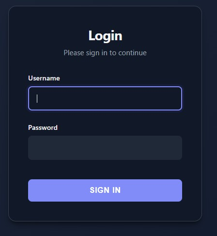

# Authentication

Secure your tools with built-in username/password authentication and session management.

## Basic Usage

<div class="grid" markdown>

<div markdown>

Add the `auth` parameter with username/password pairs:
```python
from func_to_web import run

def admin_dashboard(action: str, value: int):
    return f"Action '{action}' executed with value: {value}"

run(
    admin_dashboard,
    auth={
        "admin": "secure_password_123",
        "user": "another_password"
    }
)
```

Users must log in before accessing the interface.

</div>

<div markdown>



</div>

</div>

## Session Management

Sessions are automatically managed with secure, signed cookies:
```python
run(
    my_function,
    auth={"admin": "password"},
    secret_key="your-secret-key-here"  # Optional
)
```

- **Auto-login**: Users stay logged in (default: 2 weeks)
- **Logout**: Button appears in header when authenticated
- **Stateless**: No database required

## Multiple Functions

Protect multiple tools with a single login:
```python
from func_to_web import run

def payroll(): 
    return "Payroll Data"

def reports(): 
    return "Q4 Reports"

run(
    [payroll, reports],
    auth={"admin": "admin_pass", "analyst": "finance_pass"}
)
```

## Is This Secure?

**Yes.** With a strong, unique password and HTTPS, this authentication is **as secure as JWT, OAuth, or Auth0**.

**Why?** All authentication systems work the same way after login:
1. User authenticates (password, OAuth, biometric, etc.)
2. Server issues a signed session cookie
3. Cookie grants access until expiration

**The weak point is always the session cookie, not the authentication method.** If an attacker steals the cookie (network sniffing without HTTPS, malware, XSS), they gain access - regardless of whether you used a password or Google OAuth to obtain it.

**This vulnerability exists in ALL web systems.** The solution:
- ✅ **HTTPS** (prevents network sniffing) - Required
- ✅ **HttpOnly cookies** (prevents XSS) - Enabled by default
- ✅ **SameSite cookies** (prevents CSRF) - Enabled by default

## Built-in Security

- ✅ **Cryptographically signed cookies**: Tamper-proof sessions
- ✅ **HttpOnly cookies**: Protected from JavaScript (XSS prevention)
- ✅ **SameSite='Lax' cookies**: CSRF protection
- ✅ **Timing-attack safe**: `secrets.compare_digest` for passwords
- ✅ **Session expiration**: Automatic timeout (2 weeks default)

**Same protections as enterprise auth systems.**

## What You Must Configure

### 1. Strong, Unique Passwords (Critical)

**With 16+ random characters, brute-force is mathematically impossible** - even at 1 million attempts/second, it takes trillions of years.
```python
# ❌ Weak - crackable in minutes
auth={"admin": "admin123"}

# ✅ Strong - mathematically unbreakable
auth={"admin": "Tr$9mK#pL2@vN8^qX5&wR7!"}
```

**Generate strong passwords:**
```bash
python -c "import secrets; print(secrets.token_urlsafe(24))"
# Output: "xK9_mPvL8-qR5wN2tY7sX4zM"
```

**Critical:** Use **unique** passwords. If leaked elsewhere, attackers will try them here first (credential stuffing).

### 2. HTTPS (Critical)

**Always use HTTPS** - without it, session cookies can be intercepted:
```
Attack without HTTPS:
1. User logs in on WiFi
2. Attacker on same network sniffs traffic
3. Session cookie stolen → full access without password
```

**This applies to ALL web authentication** (yours, OAuth, Auth0). HTTPS is mandatory.

## Deployment Options

### Option 1: Behind Nginx (Recommended for Production)

**Best for:** Production, public internet
```python
# App on localhost
run(
    my_function,
    host="127.0.0.1",
    auth={"admin": os.environ["ADMIN_PASSWORD"]},
    secret_key=os.environ["SECRET_KEY"]
)
```

**Nginx handles HTTPS + rate limiting:**
```nginx
server {
    listen 443 ssl http2;
    server_name myapp.example.com;
    
    ssl_certificate /etc/letsencrypt/live/myapp.example.com/fullchain.pem;
    ssl_certificate_key /etc/letsencrypt/live/myapp.example.com/privkey.pem;
    
    location / {
        proxy_pass http://127.0.0.1:8000;
        proxy_set_header Host $host;
        proxy_set_header X-Real-IP $remote_addr;
        limit_req zone=login burst=5 nodelay;
    }
}

http {
    limit_req_zone $binary_remote_addr zone=login:10m rate=10r/m;
}
```
```bash
# Setup SSL with Let's Encrypt
sudo apt install certbot python3-certbot-nginx
sudo certbot --nginx -d myapp.example.com
# Auto-renewal configured automatically
```

**Security:** ✅ Excellent (HTTPS + rate limiting + auto-renewal)

---

### Option 2: Internal Network / VPN

**Best for:** Company intranet, VPN-only access
```python
run(
    my_function,
    host="0.0.0.0",  # or VPN IP: "100.64.x.x"
    auth={"admin": os.environ["ADMIN_PASSWORD"]},
    secret_key=os.environ["SECRET_KEY"]
)
```

**Enable HTTPS via Nginx (recommended) or direct SSL (see below).**

**Requirements:**
- ✅ Strong password
- ✅ HTTPS enabled
- ⚠️ Rate limiting optional (trusted network)

**Security:** ✅ Secure (protected by network perimeter)

---

### Option 3: Direct HTTPS (Development/Testing)

**Best for:** Local development, testing, demos
```python
run(
    my_function,
    host="0.0.0.0",
    auth={"admin": os.environ["ADMIN_PASSWORD"]},
    secret_key=os.environ["SECRET_KEY"],
    ssl_keyfile="./key.pem",
    ssl_certfile="./cert.pem"
)
```

**Generate self-signed certificate:**
```bash
openssl req -x509 -newkey rsa:4096 \
  -keyout key.pem -out cert.pem \
  -days 365 -nodes -subj "/CN=localhost"
```

**Security:** ✅ Good (HTTPS enabled, manual cert management)

## Best Practices

**1. Generate strong passwords**
```bash
python -c "import secrets; print(secrets.token_urlsafe(24))"
```

**2. Use environment variables**
```python
import os
run(
    my_function,
    auth={"admin": os.environ["ADMIN_PASSWORD"]},
    secret_key=os.environ["SECRET_KEY"]
)
```
```bash
# Generate secret key
python -c "import secrets; print(secrets.token_hex(32))"

# Set environment variables
export ADMIN_PASSWORD="strong-unique-password"
export SECRET_KEY="generated-secret-key"
python main.py
```

**3. Always enable HTTPS** (Nginx or direct SSL)

**4. Restrict network access**
```python
host="127.0.0.1"       # Localhost only (behind proxy)
host="192.168.1.100"   # Specific interface
```

## Security Comparison

| System | Session Security | Cookie Protection | Auth Method | 2FA | Audit Logs |
|--------|-----------------|-------------------|-------------|-----|------------|
| **func-to-web** | Signed cookies | ✅ HttpOnly + SameSite | Password | ❌ | ❌ |
| **JWT** | Signed tokens | ✅ HttpOnly + SameSite | Password/Key | ⚠️ Optional | ⚠️ Optional |
| **OAuth/Auth0** | Signed tokens | ✅ HttpOnly + SameSite | OAuth/SAML | ✅ | ✅ |

**Base session security is identical.** Commercial solutions add features (2FA, audit logs, user management), not stronger cookie protection.

## When to Use External Auth

Use Auth0/OAuth when you need:
- ✅ Two-factor authentication (2FA)
- ✅ Audit logs (track who did what, when)
- ✅ Compliance requirements (SOC 2, HIPAA)
- ✅ Social login (Google, GitHub, etc.)

**For internal tools with strong passwords + HTTPS, built-in auth is equally secure.**

## Quick Security Checklist

| Requirement | Internal Network | VPN | Public Internet |
|-------------|-----------------|-----|----------------|
| Strong password (16+ chars, unique) | ✅ Required | ✅ Required | ✅ Required |
| HTTPS | ✅ Required | ✅ Required | ✅ Required |
| Rate limiting | ⚠️ Optional | ⚠️ Optional | ✅ Required |

## Examples
```python
# Production behind Nginx
run(
    my_func,
    host="127.0.0.1",
    auth={"admin": os.environ["ADMIN_PASSWORD"]},
    secret_key=os.environ["SECRET_KEY"]
)

# Development with direct HTTPS
run(
    my_func,
    auth={"admin": os.environ["ADMIN_PASSWORD"]},
    ssl_keyfile="./key.pem",
    ssl_certfile="./cert.pem"
)

# Internal network
run(
    my_func,
    host="0.0.0.0",
    auth={"admin": os.environ["ADMIN_PASSWORD"]}
)
```

**Note:** All authenticated users have full access to all functions. Implement role-based logic within your functions if needed.

## Summary

Built-in authentication is secure when configured properly:

✅ **Strong, unique passwords** → Brute-force impossible  
✅ **HTTPS** → Cookies protected from interception  
✅ **Signed cookies** → Same security as JWT/OAuth  
⚠️ **Rate limiting (via Nginx)** → Optional for trusted networks, required for public

**The authentication mechanism is as secure as enterprise solutions.** The difference is additional features (2FA, audit logs), not base security.

## Next Steps

- [Server Configuration](server-configuration.md) - Host, port, SSL settings
- [Multiple Functions](multiple.md) - Serve multiple functions