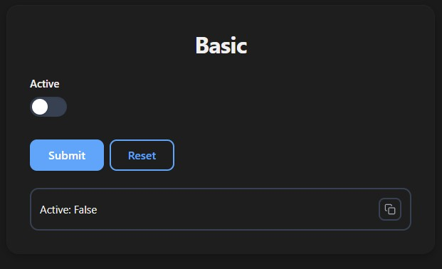
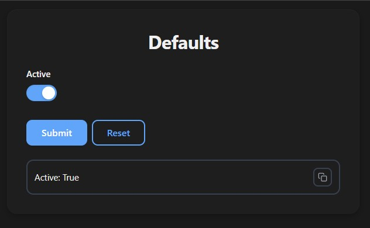
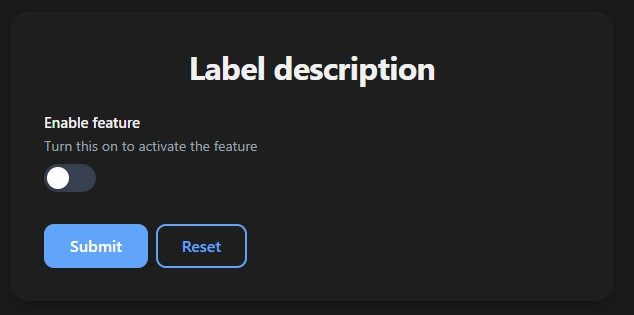
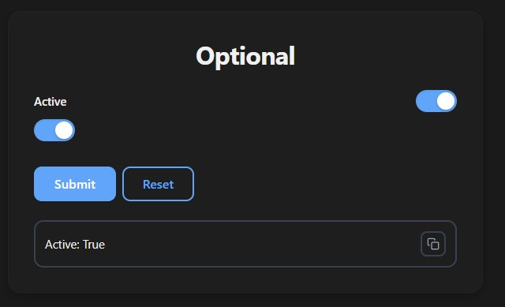
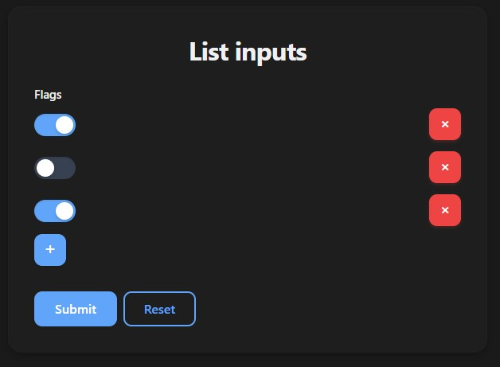

# Boolean Input

Use `bool` for true/false inputs. Renders as a toggle switch.

## Basic Usage

```python
from func_to_web import run

def basic(active: bool):
    return f"Active: {active}"

run(basic)
```



## Default Value

```python
from func_to_web import run

def defaults(active: bool = True):
    return f"Active: {active}"

run(defaults)
```



## Label & Description

```python
from typing import Annotated
from func_to_web import run
from func_to_web.types import Label, Description

def label_description(
    active: Annotated[bool, Label("Enable feature"), Description("Turn this on to activate the feature")],
):
    return f"Active: {active}"

run(label_description)
```



## Optional

```python
from func_to_web import run

def optional(active: bool | None = None):
    return f"Active: {active}"

run(optional)
```

> For full control over the toggle's initial state (`OptionalEnabled` / `OptionalDisabled`), see [Optional Types](optional.md).



## List

```python
from func_to_web import run

def list_inputs(flags: list[bool]):
    return f"Flags: {flags}"

run(list_inputs)
```

> For list constraints and more, see [Lists](lists.md).

