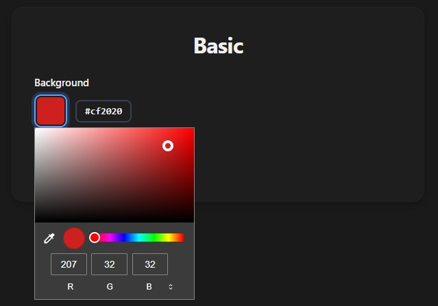
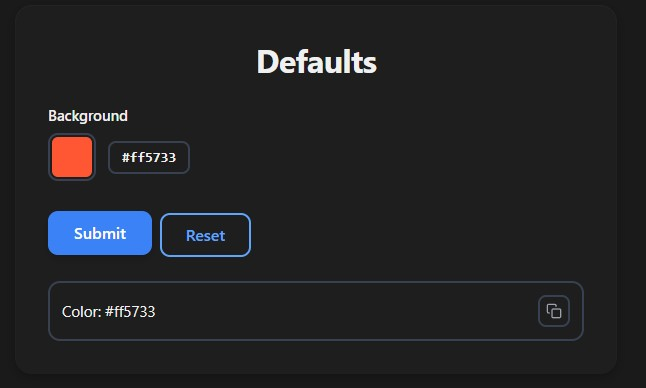
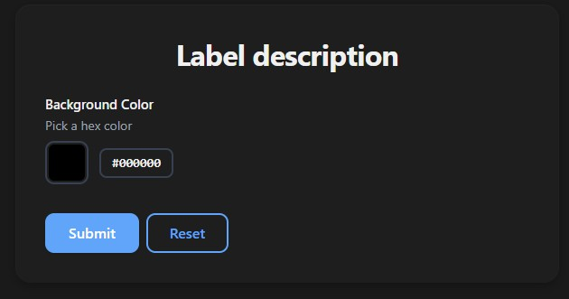
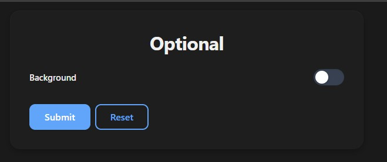
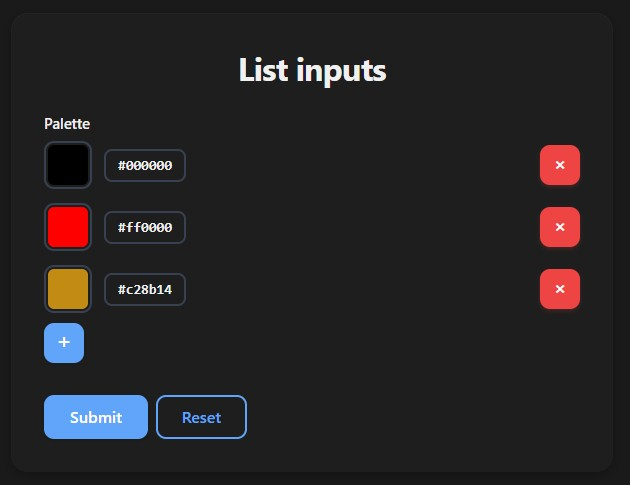

# Color Input

Use `Color` for hex color inputs. Renders as a native color picker with a hex value display.

`Color` is a ready-made string type — under the hood it's a `str` with a hex pattern validator (`#RGB` or `#RRGGBB`).

## Basic Usage

```python
from func_to_web import run
from func_to_web.types import Color

def basic(background: Color):
    return f"Color: {background}"

run(basic)
```



## Default Value

```python
from func_to_web import run
from func_to_web.types import Color

def defaults(background: Color = "#FF5733"):
    return f"Color: {background}"

run(defaults)
```



## Label & Description

```python
from typing import Annotated
from func_to_web import run
from func_to_web.types import Color, Label, Description

def label_description(
    background: Annotated[Color, Label("Background Color"), Description("Pick a hex color")],
):
    return f"Color: {background}"

run(label_description)
```



## Optional

```python
from func_to_web import run
from func_to_web.types import Color

def optional(background: Color | None = None):
    return f"Color: {background}"

run(optional)
```

> For full control over the toggle's initial state (`OptionalEnabled` / `OptionalDisabled`), see [Optional Types](optional.md).



## List

```python
from func_to_web import run
from func_to_web.types import Color

def list_inputs(palette: list[Color]):
    return f"Palette: {palette}"

run(list_inputs)
```

> For list constraints and more, see [Lists](lists.md).

