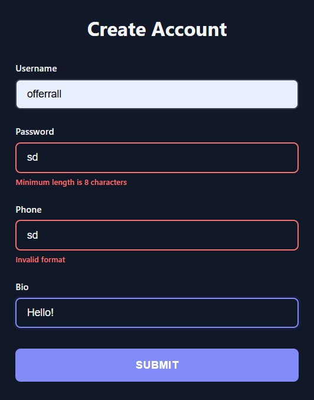

# Types Constraints

Add validation rules to your inputs using Pydantic's `Field`. All constraints work with optional fields too.

## Numeric Constraints

<div class="grid" markdown>

<div markdown>

Use `ge` (greater or equal), `le` (less or equal), `gt` (greater than), `lt` (less than):

```python
from typing import Annotated
from func_to_web import run
from pydantic import Field

def register(
    age: Annotated[int, Field(ge=18, le=120)],      # 18-120
    rating: Annotated[float, Field(gt=0, lt=5)],    # 0-5 (exclusive)
    score: Annotated[int, Field(ge=0)] = 50,        # Min 0, default 50
):
    return f"Age: {age}, Rating: {rating}, Score: {score}"

run(register)
```

Works with optional fields:

```python
age: Annotated[int, Field(ge=18, le=120)] | None = None
```

</div>

<div markdown>


</div>

</div>

## String Constraints

<div class="grid" markdown>

<div markdown>

Use `min_length`, `max_length`, and `pattern` (regex):

```python
from typing import Annotated
from func_to_web import run
from pydantic import Field

def create_account(
    username: Annotated[str, Field(min_length=3, max_length=20)],
    password: Annotated[str, Field(min_length=8)],
    phone: Annotated[str, Field(pattern=r'^\+?[0-9]{10,15}$')],
    bio: Annotated[str, Field(max_length=500)] = "Hello!",
):
    return f"Account created for {username}"

run(create_account)
```

Works with optional fields:

```python
bio: Annotated[str, Field(max_length=500)] | None = None
```

</div>

<div markdown>



</div>

</div>

## List Constraints

Lists support two levels of validation: item-level and list-level.

### Item-Level Constraints

<div class="grid" markdown>

<div markdown>

Validate each individual item in the list:

```python
from typing import Annotated
from func_to_web import run
from pydantic import Field

def process_data(
    # Each score must be between 0-100
    scores: list[Annotated[int, Field(ge=0, le=100)]],
    
    # Each username must be at least 3 characters
    usernames: list[Annotated[str, Field(min_length=3)]],
):
    return f"Processed {len(scores)} scores"

run(process_data)
```

Each item is validated individually with error messages shown per item.

</div>

<div markdown>


</div>

</div>

### List-Level Constraints

<div class="grid" markdown>

<div markdown>

Validate the list size (number of items):

```python
from typing import Annotated
from func_to_web import run
from pydantic import Field

def create_team(
    # Must have between 2-5 members
    members: Annotated[list[str], Field(min_length=2, max_length=5)],
    
    # Must have at least 3 tags
    tags: Annotated[list[str], Field(min_length=3)],
):
    return f"Team created with {len(members)} members"

run(create_team)
```

The list itself must meet the size requirements.

</div>

<div markdown>


</div>

</div>

### Combined Constraints

<div class="grid" markdown>

<div markdown>

Combine both item-level and list-level validation:

```python
from typing import Annotated
from func_to_web import run
from pydantic import Field

def rate_products(
    # 3-10 ratings, each rating must be 1-5
    ratings: Annotated[
        list[Annotated[int, Field(ge=1, le=5)]], 
        Field(min_length=3, max_length=10)
    ],
):
    return f"Received {len(ratings)} ratings"

run(rate_products)
```

Both the list size and each individual item are validated.

Works with optional lists:

```python
ratings: Annotated[
    list[Annotated[int, Field(ge=1, le=5)]], 
    Field(min_length=3, max_length=10)
] | None = None
```

</div>

<div markdown>


</div>

</div>

## Key Points

- All constraints work with **optional fields** (`Type | None`)
- **Numeric**: `ge`, `le`, `gt`, `lt` for min/max bounds
- **String**: `min_length`, `max_length`, `pattern` for validation
- **Lists**: Item-level, list-level, or both combined
- Error messages are shown in the UI automatically
- Client and server-side validation for robust input handling

## What's Next?

You've completed all **Input Types** and **Constraints**! Now learn about output types.

**Next category:**

- [Images & Plots](images.md) - Return images and plots from your functions
- [File Downloads](downloads.md) - Return files for users to download
- [Tables](tables.md) - Return tables from lists or DataFrames
- [Multiple Outputs](multiple-outputs.md) - Return multiple outputs from a single function