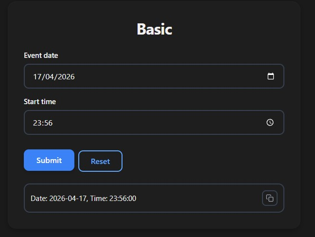
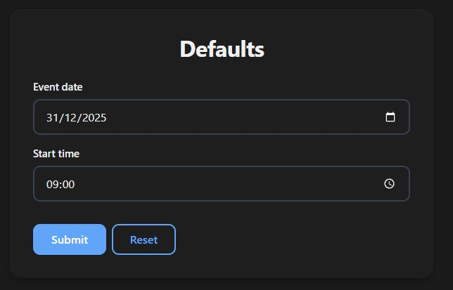
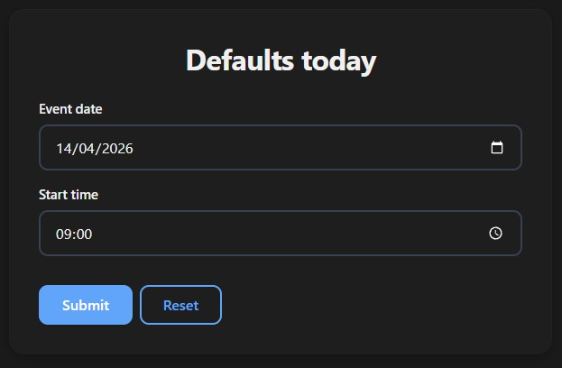
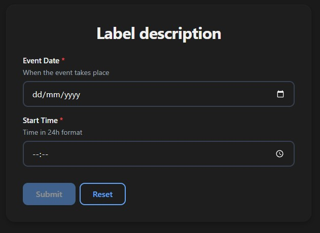
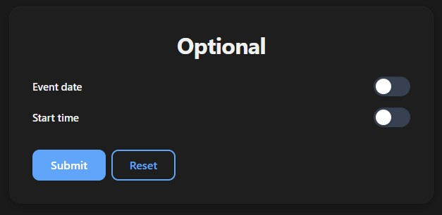
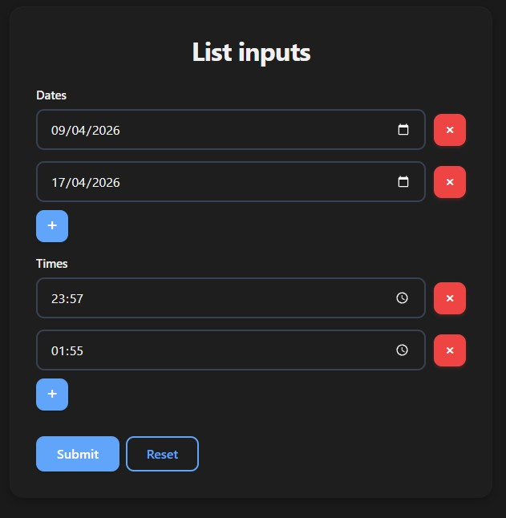

# Date & Time Inputs

Use `date` for date pickers and `time` for time pickers. Both come from Python's standard `datetime` module.

## Basic Usage

```python
from datetime import date, time
from func_to_web import run

def basic(event_date: date, start_time: time):
    return f"Date: {event_date}, Time: {start_time}"

run(basic)
```



## Default Value

```python
from datetime import date, time
from func_to_web import run

def defaults(
    event_date: date = date(2025, 12, 31),
    start_time: time = time(9, 0),
):
    return f"Date: {event_date}, Time: {start_time}"

run(defaults)
```



Use `date.today()` to default to the current date:

```python
from datetime import date, time
from func_to_web import run

def defaults_today(
    event_date: date = date.today(),
    start_time: time = time(9, 0),
):
    return f"Date: {event_date}, Time: {start_time}"

run(defaults_today)
```



## Label & Description

```python
from typing import Annotated
from datetime import date, time
from func_to_web import run
from func_to_web.types import Label, Description

def label_description(
    event_d: Annotated[date, Label("Event Date"), Description("When the event takes place")],
    start_t: Annotated[time, Label("Start Time"), Description("Time in 24h format")],
):
    return f"Date: {event_d}, Time: {start_t}"

run(label_description)
```



## Optional

```python
from datetime import date, time
from func_to_web import run

def optional(
    event_date: date | None = None,
    start_time: time | None = None,
):
    return f"Date: {event_date}, Time: {start_time}"

run(optional)
```

> For full control over the toggle's initial state (`OptionalEnabled` / `OptionalDisabled`), see [Optional Types](optional.md).



## List

```python
from datetime import date, time
from func_to_web import run

def list_inputs(dates: list[date], times: list[time]):
    return f"Dates: {dates}, Times: {times}"

run(list_inputs)
```

> For list constraints and more, see [Lists](lists.md).

