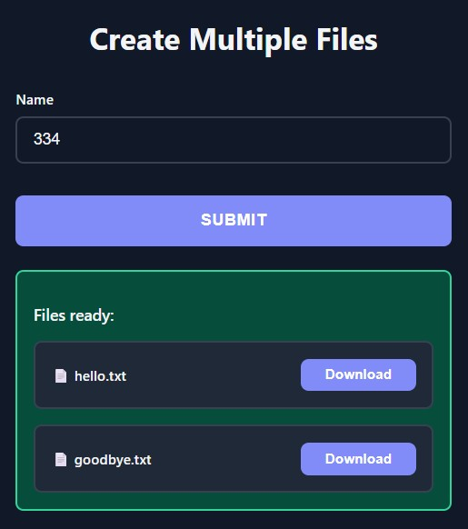

# File Downloads

Return files from your functions and users get automatic download buttons.

## Basic Usage

<div class="grid" markdown>

<div markdown>

Return `FileResponse` for single or multiple files:

```python
from func_to_web import run
from func_to_web.types import FileResponse

def create_multiple_files(name: str):
    file1 = FileResponse(
        data=f"Hello {name}!".encode('utf-8'),
        filename="hello.txt"
    )
    file2 = FileResponse(
        data=f"Goodbye {name}!".encode('utf-8'),
        filename="goodbye.txt"
    )
    return [file1, file2]

run(create_multiple_files)
```

</div>

<div markdown>



</div>

</div>

## Key Features

- **Single file**: Return `FileResponse(data=bytes, filename="file.ext")`
- **Multiple files**: Return `[FileResponse(...), FileResponse(...)]`
- **Any file type**: PDF, Excel, ZIP, images, JSON, CSV, binary data, etc.
- **Large files**: Uses streaming - handles GB+ files efficiently
- **Clean UI**: List of files with individual download buttons
- **Automatic cleanup**: Temporary files removed after download

## Working with Libraries

Works with any library that generates files:

```python
from func_to_web import run
from func_to_web.types import FileResponse
import io

# PDF generation
from reportlab.pdfgen import canvas

def create_pdf(title: str):
    buffer = io.BytesIO()
    pdf = canvas.Canvas(buffer)
    pdf.drawString(100, 750, title)
    pdf.save()
    return FileResponse(data=buffer.getvalue(), filename="document.pdf")

# Excel generation
import pandas as pd

def create_excel(rows: int):
    df = pd.DataFrame({'A': range(rows), 'B': range(rows)})
    buffer = io.BytesIO()
    df.to_excel(buffer, index=False)
    return FileResponse(data=buffer.getvalue(), filename="data.xlsx")

# ZIP files
import zipfile

def create_archive(file_count: int):
    buffer = io.BytesIO()
    with zipfile.ZipFile(buffer, 'w') as zf:
        for i in range(file_count):
            zf.writestr(f'file{i}.txt', f'Content {i}')
    return FileResponse(data=buffer.getvalue(), filename="archive.zip")

run([create_pdf, create_excel, create_archive])
```

## Performance

- **No size limits**: Uses temporary files and streaming
- **Constant memory usage**: Regardless of file size
- **Same efficiency as file uploads**: 8MB chunks
- **Automatic cleanup**: Files deleted after download

## File Cleanup

Generated files are stored in the system's temporary directory and automatically deleted after download. Files not downloaded will be cleaned up by the OS eventually (typically on restart or after several days). 

For high-traffic production environments with many generated files, consider implementing custom cleanup logic or custom file saving strategies.

## What's Next?

You've completed all **Output Types**! Explore additional features.

**Next category:**

- [Multiple Outputs](multiple-outputs.md) - Return multiple outputs from a single function