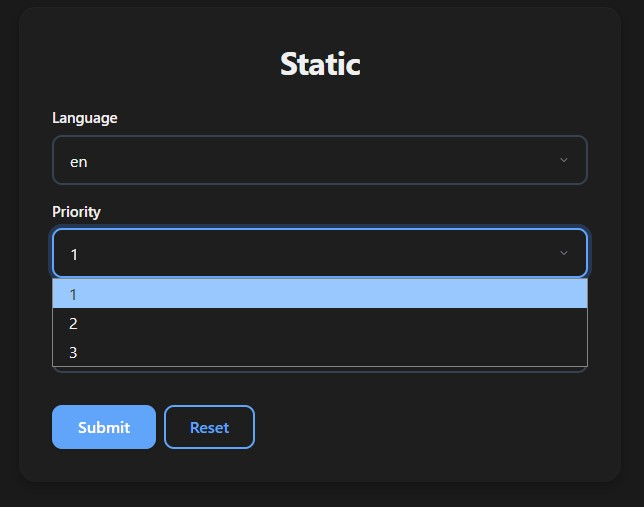
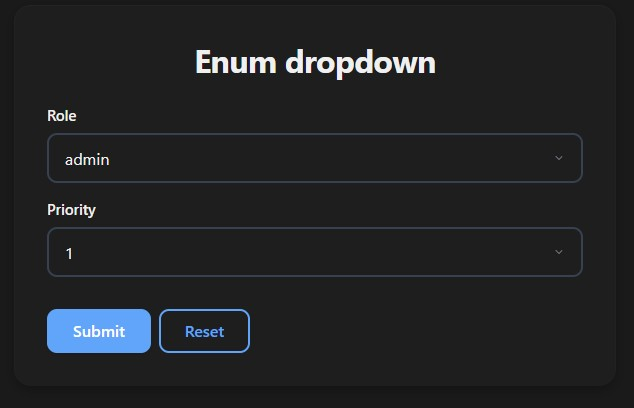
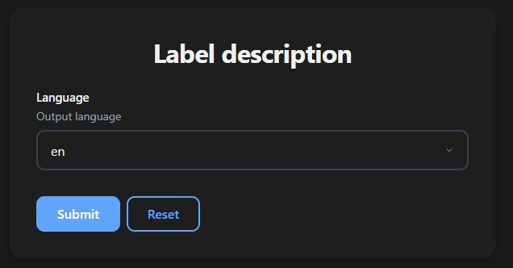
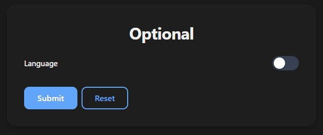

# Dropdowns

Use dropdowns for fixed or dynamic selection inputs. Works with `str`, `int`, and `float` values.

## Static Dropdowns

Use `Literal` for a fixed set of options:

```python
from typing import Literal
from func_to_web import run

def static(
    language: Literal["en", "es", "fr"],
    priority: Literal[1, 2, 3],
    factor:   Literal[0.25, 0.5, 1.0, 2.0],
):
    return f"Language: {language}, Priority: {priority}"

run(static)
```

All options must be the same type. Static values are validated server-side.



## Enum Dropdowns

Use Python `Enum` for named constants — your function receives the full Enum member:

```python
from enum import Enum
from func_to_web import run

class Role(Enum):
    ADMIN  = "admin"
    EDITOR = "editor"
    VIEWER = "viewer"

class Priority(Enum):
    LOW    = 1
    MEDIUM = 2
    HIGH   = 3

def enum_dropdown(role: Role, priority: Priority):
    return f"Role: {role.name} ({role.value}), Priority: {priority.name}"

run(enum_dropdown)
```

Useful when the same options are reused across multiple functions.



## Dynamic Dropdowns

Use `Dropdown` to generate options at runtime — the function is called every time the form is rendered:

```python
from typing import Annotated
from func_to_web import run
from func_to_web.types import Dropdown

def get_languages():
    return ["en", "es", "fr", "de"]  # Could come from a DB or API

def dynamic(language: Annotated[str, Dropdown(get_languages)]):
    return f"Language: {language}"

run(dynamic)
```

> ⚠️ Dynamic dropdowns are **not validated server-side** — the options may change between form render and submission. Validate the value yourself if it matters:

```python
def dynamic_validated(language: Annotated[str, Dropdown(get_languages)]):
    if language not in get_languages():
        raise ValueError(f"Invalid language: {language}")
    return f"Language: {language}"
```

## Default Value

```python
from typing import Literal
from func_to_web import run

def defaults(language: Literal["en", "es", "fr"] = "en"):
    return f"Language: {language}"

run(defaults)
```

## Label & Description

```python
from typing import Annotated, Literal
from func_to_web import run
from func_to_web.types import Label, Description

def label_description(
    language: Annotated[Literal["en", "es", "fr"], Label("Language"), Description("Output language")],
):
    return f"Language: {language}"

run(label_description)
```



## Optional

```python
from typing import Literal
from func_to_web import run

def optional(language: Literal["en", "es", "fr"] | None = None):
    return f"Language: {language}"

run(optional)
```

> For full control over the toggle's initial state (`OptionalEnabled` / `OptionalDisabled`), see [Optional Types](optional.md).


