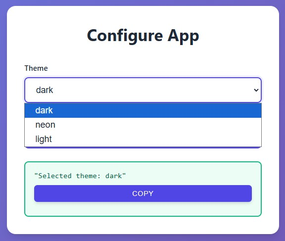

# Dropdowns

Use dropdown menus for fixed or dynamic selection options.

## Static Dropdowns

<div class="grid" markdown>

<div markdown>

Use `Literal` for fixed dropdown options:
```python
from typing import Literal
from func_to_web import run

def preferences(
    theme: Literal['light', 'dark', 'auto'],
    language: Literal['en', 'es', 'fr']
):
    return f"Theme: {theme}, Language: {language}"

run(preferences)
```

All options must be literals (strings, numbers, booleans) and all options must be of the same type.

</div>

<div markdown>


</div>

</div>

## Enum Dropdowns

<div class="grid" markdown>

<div markdown>

Use Python `Enum` for reusable dropdowns with named constants:
```python
from enum import Enum
from func_to_web import run

class Theme(Enum):
    LIGHT = 'light'
    DARK = 'dark'
    AUTO = 'auto'

def preferences(theme: Theme):
    # Receives Theme.LIGHT, not just 'light'
    return f"Selected: {theme.name} = {theme.value}"

run(preferences)
```

Your function receives the Enum member with access to both `.name` and `.value`. Useful when the same options are used in multiple functions.

</div>

<div markdown>


</div>

</div>

## Dynamic Dropdowns

<div class="grid" markdown>

<div markdown>

Use functions inside `Literal` to generate options dynamically at runtime:
```python
from typing import Literal
from random import sample
from func_to_web import run

THEMES = ['light', 'dark', 'auto', 'neon', 'retro']

def get_themes():
    """Generate random subset of themes"""
    return sample(THEMES, k=3)

def configure_app(
    theme: Literal[get_themes],  # type: ignore
):
    """Configure app with dynamic dropdown"""
    return f"Selected theme: {theme}"

run(configure_app)
```

The `# type: ignore` comment is needed to suppress type checker warnings.

</div>

<div markdown>



</div>

</div>

## Use Cases for Dynamic Dropdowns

- Load options from a database
- Fetch data from an API
- Generate options based on time or context
- Filter available choices based on business logic

The function is called each time the form is generated, ensuring fresh options every time.

## What's Next?

You've completed all **Input Types**! Now it's time to learn about adding validation rules.

**Next category:**

- [Types Constraints](constraints.md) - Add validation rules to any type and lists