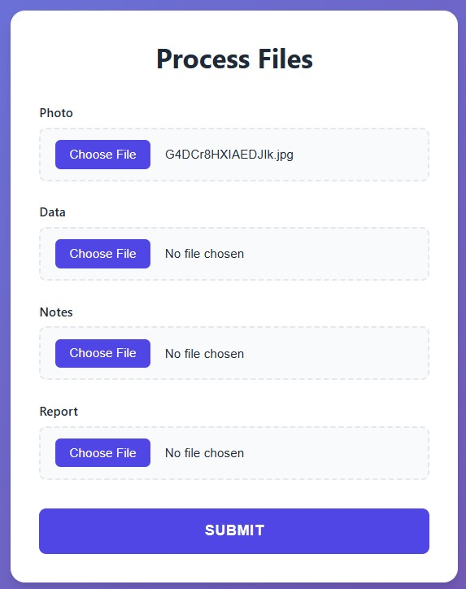
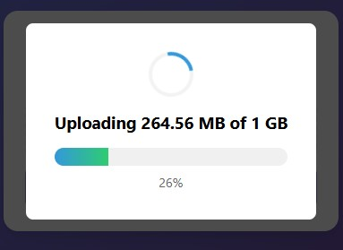

# File Uploads

Handle file uploads easily with specialized file types.

<div class="grid" markdown>

<div markdown>

func-to-web provides specialized file types for different use cases:
```python
from func_to_web import run
from func_to_web.types import ImageFile, DataFile, TextFile, DocumentFile, File, VideoFile, AudioFile

def process_files(
    any_file: File,         # any file type
    photo: ImageFile,       # .png, .jpg, .jpeg, .gif, .webp...
    video: VideoFile,       # .mp4, .mov, .avi, .mkv...
    audio: AudioFile,       # .mp3, .wav, .aac...
    data: DataFile,         # .csv, .xlsx, .xls, .json...
    notes: TextFile,        # .txt, .md, .log...
    report: DocumentFile    # .pdf, .doc, .docx...
):
    return "Files uploaded successfully!"

run(process_files)
```

Each file type automatically validates the file extension and provides appropriate file picker filters in the UI.

All file types are represented as strings (file paths) in your function.

</div>

<div markdown>



</div>

</div>

## Upload Progress & Performance

<div class="grid" markdown>

<div markdown>

When uploading files, you'll see real-time feedback:

- **Progress bar** showing 0-100% completion
- **File size display** (e.g., "Uploading 245 MB of 1.2 GB")

**Performance highlights:**

- **Large file support**: Efficiently handles 1GB to 10GB+ files
- **High speeds**: ~237 MB/s localhost, ~100-115 MB/s on Gigabit Ethernet
- **Low memory footprint**: Constant memory usage regardless of file size

</div>

<div markdown>



</div>

</div>

## Working with Uploaded Files

Uploaded files are saved to the uploads directory. You can access them as file paths:
```python
from func_to_web import run
from func_to_web.types import ImageFile
from PIL import Image

def process_image(image: ImageFile):
    # image is a file path (str)
    img = Image.open(image)
    # Process the image...
    return f"Image size: {img.size}"

run(process_image)
```

## Multiple File Uploads

Upload multiple files at once using lists:
```python
from func_to_web import run
from func_to_web.types import ImageFile

def process_multiple_images(images: list[ImageFile]):
    # images is a list of file paths
    for img_path in images:
        img = Image.open(img_path)
        # Process each image...
    return f"Processed {len(images)} images"

run(process_multiple_images)
```

Click the **+** button to add more files from other folders

## Automatic Upload Cleanup

By default, uploaded files are **automatically deleted** after your function finishes processing:
```python
from func_to_web import run
from func_to_web.types import ImageFile
from PIL import Image, ImageFilter

def process_image(image: ImageFile):
    img = Image.open(image)
    result = img.filter(ImageFilter.BLUR)
    return result
    # File automatically deleted after return

run(process_image)  # auto_delete_uploads=True by default
```

**Disable auto-delete** if you need files to persist:
```python
run(process_image, auto_delete_uploads=False)
```

**Configure upload directory:**
```python
run(
    process_image,
    uploads_dir="/path/to/uploads",
    auto_delete_uploads=True
)
```

## File Cleanup for Uploaded Files

**By default**, func-to-web **automatically cleans up** uploaded files after processing (`auto_delete_uploads=True`). This is the recommended behavior.

**If you disable auto-delete** (`auto_delete_uploads=False`), files remain in the uploads directory **indefinitely** until you manually delete them. The OS will **not** clean them automatically.

### Cleanup Options

**Option 1: Use auto-delete (default, recommended)**
```python
def process_image(image: ImageFile):
    img = Image.open(image)
    result = img.filter(ImageFilter.BLUR)
    return result
    # File automatically deleted after processing

run(process_image)  # auto_delete_uploads=True by default
```

**Option 2: Disable auto-delete** (files persist indefinitely)
```python
def process_image(image: ImageFile):
    img = Image.open(image)
    return img.filter(ImageFilter.BLUR)
    # File remains in uploads directory forever

run(process_image, auto_delete_uploads=False)
```

**When to disable auto-delete:**

- You need to access files after the function completes
- Multiple functions need to process the same file
- You're implementing your own cleanup logic

**If auto-delete is disabled**, you must manually clean up:
```python
import os
from pathlib import Path

# Manual cleanup script
uploads_dir = Path("./uploads")
for file in uploads_dir.glob("upload_*"):
    os.unlink(file)
```

**Recommendation:** Use the default `auto_delete_uploads=True` unless you have a specific reason to preserve uploaded files.

### Returned Files (Different Behavior)

Files you **return** using `FileResponse` are handled differently and **are** automatically cleaned up by func-to-web after 1 hour (hardcoded). See [File Downloads](downloads.md) for details.

## Next Steps

- [Lists](lists.md) - Learn about list inputs
- [Optional Types](optional.md) - Make parameters optional
- [Dropdowns](dropdowns.md) - Use dropdown menus for inputs