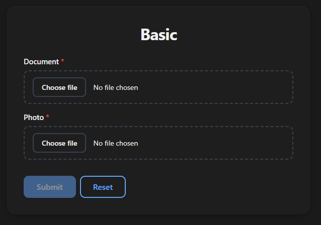
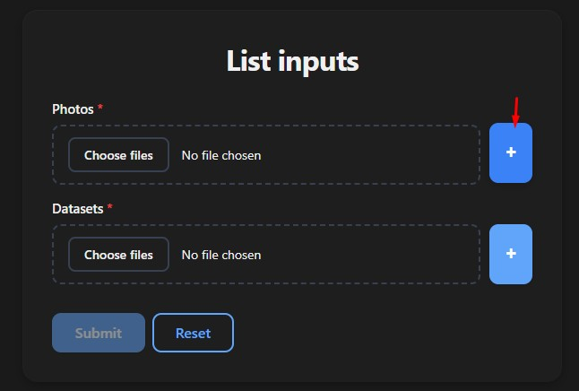
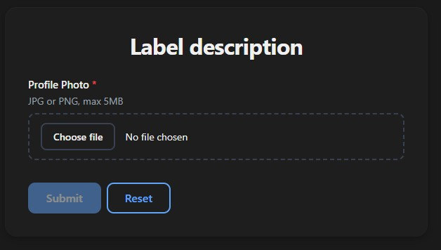

# File Uploads

FuncToWeb provides specialized file types for upload inputs. All file types are strings (file paths) inside your function — the type only controls which extensions are accepted and how the picker is filtered in the UI.

## Basic Usage

```python
from func_to_web import run
from func_to_web.types import File, ImageFile

def basic(document: File, photo: ImageFile):
    return f"Got: {document}, {photo}"

run(basic)
```



## Available Types

| Type           | Accepted Extensions                                      |
|----------------|----------------------------------------------------------|
| `File`         | Any file                                                 |
| `ImageFile`    | `.png`, `.jpg`, `.jpeg`, `.gif`, `.webp`, `.bmp`, `.svg`, `.heic`, ... |
| `VideoFile`    | `.mp4`, `.mov`, `.avi`, `.mkv`, `.wmv`, `.webm`, ...     |
| `AudioFile`    | `.mp3`, `.wav`, `.aac`, `.flac`, `.ogg`, `.m4a`          |
| `DataFile`     | `.csv`, `.xlsx`, `.xls`, `.json`, `.xml`, `.yaml`        |
| `TextFile`     | `.txt`, `.md`, `.log`, `.rtf`                            |
| `DocumentFile` | `.pdf`, `.doc`, `.docx`, `.ppt`, `.pptx`, `.odt`, ...    |

```python
from func_to_web import run
from func_to_web.types import ImageFile, VideoFile, AudioFile, DataFile, TextFile, DocumentFile, File

def all_types(
    photo:    ImageFile,
    clip:     VideoFile,
    song:     AudioFile,
    dataset:  DataFile,
    notes:    TextFile,
    report:   DocumentFile,
    anything: File,
):
    return "Files received"

run(all_types)
```

## Working with Files

Inside your function, file inputs are plain string paths — open them with any library:

```python
from func_to_web import run
from func_to_web.types import ImageFile, DataFile
from PIL import Image
import pandas as pd

def working_with_files(photo: ImageFile, dataset: DataFile):
    img = Image.open(photo)
    df = pd.read_csv(dataset)
    return f"Image: {img.size}, Rows: {len(df)}"

run(working_with_files)
```

## List of Files

Upload multiple files of the same type using `list`:

```python
from func_to_web import run
from func_to_web.types import ImageFile, DataFile

def list_inputs(photos: list[ImageFile], datasets: list[DataFile]):
    return f"Got {len(photos)} photos and {len(datasets)} datasets"

run(list_inputs)
```

Click the **+** button in the UI to add more files from different folders.

> For list constraints and more, see [Lists](lists.md).



## Optional

```python
from func_to_web import run
from func_to_web.types import ImageFile

def optional(photo: ImageFile | None = None):
    if photo is None:
        return "No photo provided"
    return f"Got: {photo}"

run(optional)
```

> For full control over the toggle's initial state (`OptionalEnabled` / `OptionalDisabled`), see [Optional Types](optional.md).


## Label & Description

```python
from typing import Annotated
from func_to_web import run
from func_to_web.types import ImageFile, Label, Description

def label_description(
    photo: Annotated[ImageFile, Label("Profile Photo"), Description("JPG or PNG, max 5MB")],
):
    return f"Got: {photo}"

run(label_description)
```



## File Size Limit

Set a maximum upload size in bytes via `run()`:

```python
from func_to_web import run
from func_to_web.types import File

def file_size_limit(file: File):
    return f"Got: {file}"

run(file_size_limit, max_file_size=10 * 1024 * 1024)  # 10 MB limit
```


## Upload Cleanup

Uploaded files land in a temporary folder inside `uploads_dir` and are deleted automatically after your function finishes. If you want to keep a file permanently, move it with `shutil.move()` before returning — FuncToWeb skips cleanup on files that no longer exist in the original path:

```python
import shutil
from func_to_web import run
from func_to_web.types import ImageFile

def upload_cleanup(photo: ImageFile):
    shutil.move(photo, "/my/permanent/storage/photo.jpg")
    return "Saved!"

run(upload_cleanup)
```

To disable auto-cleanup entirely and configure the upload directory:

```python
run(upload_cleanup, keep_uploads=True, uploads_dir="/data/uploads")
```