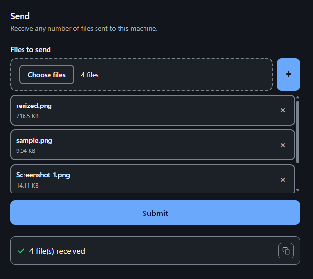

# Files

A `str` annotated with `FileHint` is a file. The function receives the path of
a file already stored on the server, and opens it like any other:

```python
from typing import Annotated

from func_to_web import FileHint, run

ImagePath = Annotated[str, FileHint(extensions=(".png", ".jpg", ".jpeg"))]


def size(image: ImagePath) -> str:
    with open(image, "rb") as file:
        return f"{len(file.read())} bytes"


run(size)
```

The function knows nothing about HTTP or uploads. `list[ImagePath]` takes
several files, and a file can sit anywhere a type can: in a dataclass, in a
list of dataclasses, in an optional.



## How a file travels

When the user picks a file, the page gives it a **reference**, a unique name
such as `annual-report-<uuid>.pdf`. On Submit it uploads the bytes to
`/upload` under that reference, and then calls the function with the reference
in place of the file. The server swaps the reference for the local path just
before the function runs.

That is why a file is uploaded only once: running the function again with other
values sends only the reference. A script can do the same, and reuse a
reference it already has without uploading anything:

```text
POST /tools/analyse/invoke
{"document": "annual-report-<uuid>.pdf", "threshold": 0.5}
```

A reference is only ever a file name: the server's paths never reach the
browser, and a reference with separators, `..` or an absolute path is refused.

## Size limits

```python
MEGABYTE = 1024 * 1024

DataFile = Annotated[str, FileHint(extensions=(".csv",), max_size=2 * MEGABYTE)]
```

- **The extension** is checked by the server on every call.
- **`min_size` and `max_size`** are checked by the browser, before uploading. A
  script that sends a reference skips them.
- **`max_upload_bytes`**, an option of the application, is the server's limit
  for every file: `/upload` stops reading past it and answers `413`.

If a size must hold whoever the client is, check it inside the function.

## How long files are kept

```text
uploaded, never used    deleted after pending_ttl (one hour by default)
used by a call          kept forever; deleting it is up to you
```

Once an execution or a prefill has used a file, its reference always names the
same bytes, so it is safe to store in a database and use again. A file is
stored in the user's data directory unless `uploads_dir` or
`FUNCTOWEB_UPLOADS_DIR` says otherwise; `run()` prints where on startup.

A default in the signature names a file already in that directory by its full
path. It is published to the page as its reference.

<details>
<summary>How it works inside</summary>

**Why `/upload` does not apply `FileHint`'s sizes.** An upload carries bytes and
a reference, not the parameter it is for: the same reference can feed two
functions with different bounds. Checking it would mean a second validator
beside pytypehint's. So the browser checks what it holds (a real `File` with a
size), the endpoint counts bytes against `max_upload_bytes`, and the core
checks the extension. Nothing stats a stored file.

**Why a second upload of the same reference is a `409`.** The page never does
it: a confirmed upload is never sent again. A second POST is a confused client
or someone overwriting a file that is not theirs, so a published reference is
immutable.

**Names.** References follow the strictest of Linux, macOS and Windows, so they
work on all three. The 204-byte limit is the 255 of `NAME_MAX` minus what
storage adds: the `.<uuid>.part` of a partial upload and the 13-byte pending
prefix. `~p` and `~r` are refused because storage marks its own names with
them: `~p<date>~` for an upload not yet used, `~r` for a returned file.

**Writing.** An upload is written to a `.part` file and published with
`os.replace`, so a file appears whole or not at all. Two simultaneous first
uploads of one reference each write their own `.part`, and one of them wins
intact; on Windows the replace is retried for a few milliseconds.

**Expiry.** One daemon thread per process sweeps both directories every 30 to
60 minutes (a random interval, so workers drift apart), and once at startup.
The first use of a pending file renames it to its bare reference, and from then
on nothing touches it.

**The resolver** is the only place that checks a file exists and belongs to
storage: its parent must be the storage directory itself, so `..`, symbolic
links and subdirectories are refused. It is the same one for `/invoke`,
`/invoke-stream` and the prefill.

</details>
