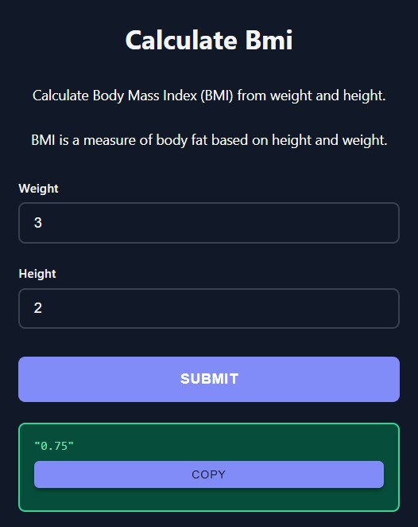

# Function Descriptions

Display helpful descriptions for your functions directly in the web UI by adding docstrings.

## Basic Usage

<div class="grid" markdown>

<div markdown>

Simply add a docstring to your function and it will automatically appear below the title:

```python
from func_to_web import run

def calculate_bmi(weight: float, height: float) -> float:
    """Calculate Body Mass Index (BMI) from weight and height.
    
    BMI is a measure of body fat based on height and weight.
    """
    return weight / (height ** 2)

run(calculate_bmi)
```

The docstring will be displayed with:
- Centered text alignment
- Theme-appropriate styling (white text in dark mode)
- Clean formatting with preserved line breaks

## Without Description

If your function doesn't have a docstring, the description simply won't be shown - the form will display normally without any extra spacing.


</div>

<div markdown>



</div>

</div>

## Next Steps

- [Multiple Functions](multiple.md) - Serve multiple functions with an index page
- [Dark Mode](dark-mode.md) - Automatic theme switching
- [Server Configuration](server-configuration.md) - Customize host, port, and templates