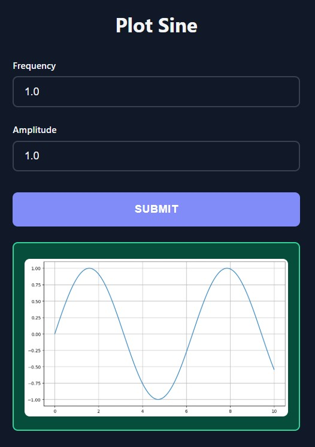

# Images & Plots

Return PIL Images and Matplotlib figures from your functions. They're automatically displayed in the UI.

## PIL Images

<div class="grid" markdown>

<div markdown>

Return PIL/Pillow `Image` objects and they'll be displayed automatically:

```python
from func_to_web import run
from func_to_web.types import ImageFile
from PIL import Image, ImageFilter

def blur_image(image: ImageFile, radius: int = 5):
    img = Image.open(image)
    return img.filter(ImageFilter.GaussianBlur(radius))

run(blur_image)
```

Any PIL Image operation works: filters, transformations, drawing, etc.

</div>

<div markdown>


</div>

</div>

## Matplotlib Plots

<div class="grid" markdown>

<div markdown>

Return Matplotlib `Figure` objects and they'll be rendered as images:

```python
from func_to_web import run
import matplotlib.pyplot as plt
import numpy as np

def plot_sine(frequency: float = 1.0, amplitude: float = 1.0):
    x = np.linspace(0, 10, 1000)
    y = amplitude * np.sin(frequency * x)
    
    fig, ax = plt.subplots(figsize=(10, 6))
    ax.plot(x, y)
    ax.grid(True)
    return fig

run(plot_sine)
```

Works with any Matplotlib plot type: line, bar, scatter, histograms, etc.

</div>

<div markdown>



</div>

</div>

## How It Works

- **PIL Images**: Automatically detected and displayed in the UI
- **Matplotlib Figures**: Rendered as PNG and shown in the browser
- **No configuration needed**: Just return the object from your function
- Works with any image processing or plotting library that returns these types

## Next Steps

- [File Downloads](downloads.md) - Return files for users to download
- [Multiple Outputs](multiple-outputs.md) - Return multiple outputs from a single function