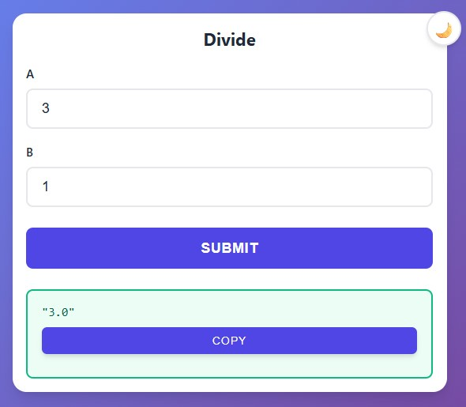

# Transform any Python function into a web interface automatically

<div class="grid" markdown>

<div markdown>

```bash
pip install func-to-web
```

```python
from func_to_web import run

# Minimal example
def divide(a: int, b: int):
    return a / b

run(divide)
```

Open `http://127.0.0.1:8000` → **Done!**

- [Input Types](types.md) - Learn about supported input types
- [Types Constraints](constraints.md) - Add input validation easily
- [Output Types](images.md) - Return images, plots, and files
- [Other Features](multiple.md) - Dark mode, multiple functions, and more

</div>

<div markdown>



</div>

</div>