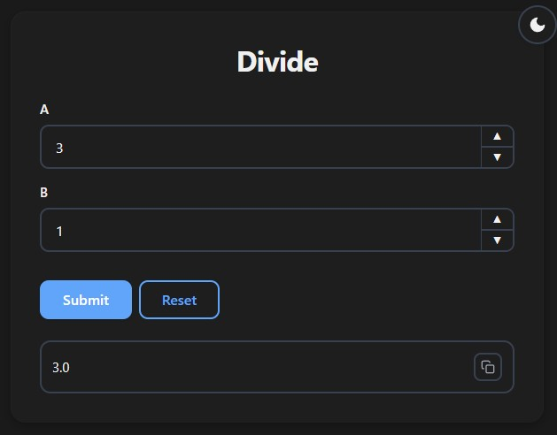

# Transform any Python function into a web interface automatically

<div class="grid" markdown>

<div markdown>

```bash
pip install func-to-web
```

```python
from func_to_web import run

# Minimal example
def divide(a: float, b: float):
    return a / b

run(divide)
```

Open `http://127.0.0.1:8000` → **Done!**

- [Input Types](numeric.md) - Learn about supported input types, validation and custom
- [Output Types](outputs.md) - Return files, images, plots, tables...
- [Other Features](config.md) - Multiple functions, Authentication, server options...

</div>

<div markdown>



</div>

</div>