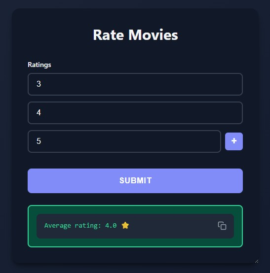
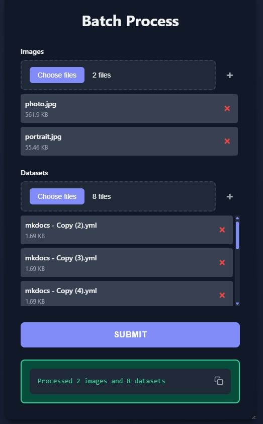

# Lists

<div class="grid" markdown>

<div markdown>

## Basic Usage
Create dynamic lists of any type with add/remove buttons.

```python
from func_to_web import run
from func_to_web.types import Color, Email

def process_data(
    # Basic type lists
    numbers: list[int],                      # List of integers
    colors: list[Color],                     # List of color pickers
    names: list[str] = ["Alice", "Bob"],     # List with defaults
):
    return f"Processed {len(numbers)} numbers, {len(names)} names"

run(process_data)
```

</div>

<div markdown>


</div>

</div>

<div class="grid" markdown>

<div markdown>

## List Constraints

```python
from func_to_web import run
from typing import Annotated
from pydantic import Field

def rate_movies(
    # Each rating 1-5, need 3-10 ratings total
    ratings: Annotated[
        list[Annotated[int, Field(ge=1, le=5)]],
        Field(min_length=3, max_length=10)
    ]
):
    avg = sum(ratings) / len(ratings)
    return f"Average rating: {avg:.1f} ⭐"

run(rate_movies)
```

</div>

<div markdown>



</div>

</div>

<div class="grid" markdown>

<div markdown>

## File Lists
Upload multiple files from different folders easily.

```python
from func_to_web import run
from func_to_web.types import ImageFile, DataFile

def batch_process(
    images: list[ImageFile],           # Multiple images
    datasets: list[DataFile],          # Multiple CSV/Excel files
):
    return f"Processed {len(images)} images and {len(datasets)} datasets"

run(batch_process)
```

**Features:**
- Select multiple files from one folder at once
- Click **"+"** button to add more files from other folders
- Remove individual files with **×** button
- See file names and sizes in real-time
- **File lists** can be combined with constraints using `Field(min_length=..., max_length=...)`

</div>

<div markdown>



</div>

</div>

## Key Features
- **Dynamic add/remove buttons** for each list
- **File uploads** support multiple files from different folders
- Works with **all types**: `int`, `float`, `str`, `bool`, `date`, `time`, `Color`, `Email`, File Types
- Default values: `list[str] = ["hello", "world"]`
- All non-optional lists require at least 1 item
- Not supported with `Literal`
- Lists cannot be nested (e.g., `list[list[int]]` is not supported)

## Next Steps

- [Optional Types](optional.md) - Make parameters optional
- [Dropdowns](dropdowns.md) - Use dropdown menus for inputs