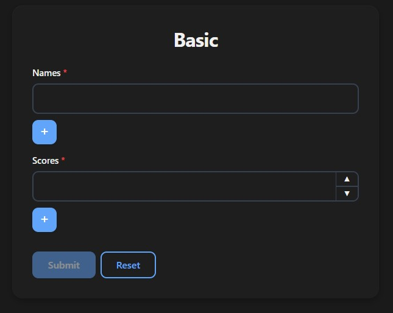
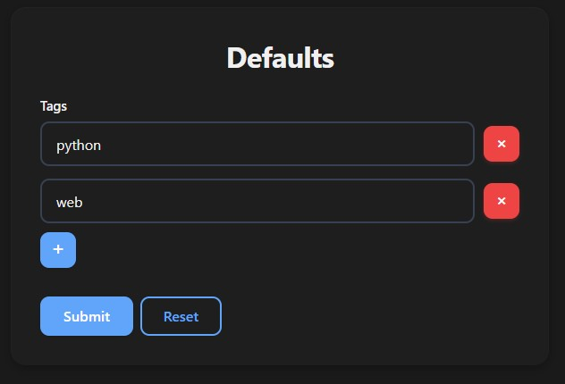
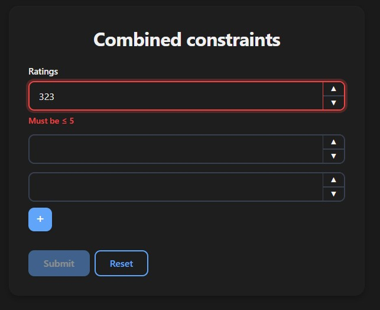
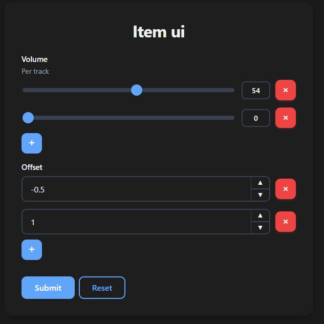
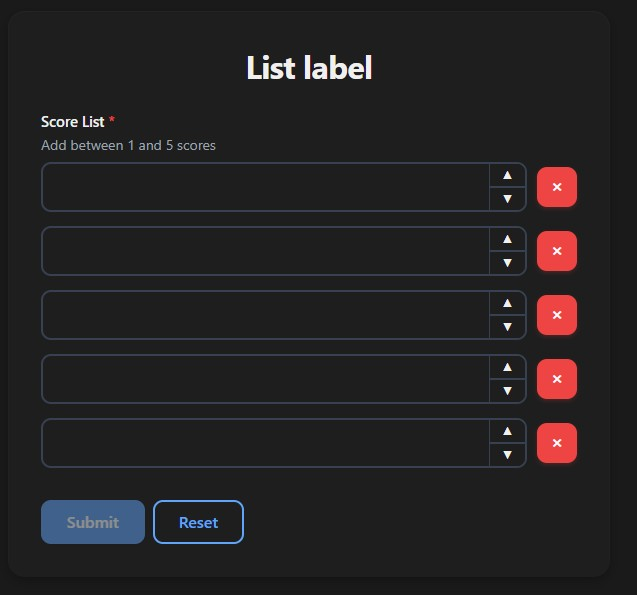
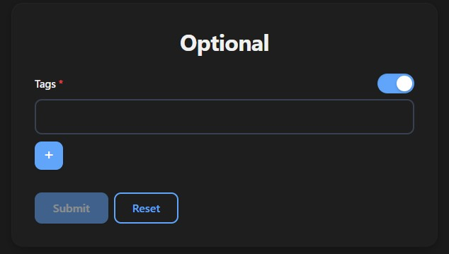

# Lists

Use `list[T]` for dynamic list inputs. Renders with add/remove buttons for each item.

## Basic Usage

```python
from func_to_web import run

def basic(names: list[str], scores: list[int]):
    return f"Names: {names}, Scores: {scores}"

run(basic)
```



## Default Values

```python
from func_to_web import run

def defaults(tags: list[str] = ["python", "web"]):
    return f"Tags: {tags}"

run(defaults)
```



## Supported Types

Works with all input types:

```python
from datetime import date, time
from func_to_web import run
from func_to_web.types import Color, Email, ImageFile

def supported_types(
    numbers:  list[int],
    decimals: list[float],
    texts:    list[str],
    flags:    list[bool],
    dates:    list[date],
    times:    list[time],
    colors:   list[Color],
    emails:   list[Email],
    photos:   list[ImageFile],
):
    return "All received"

run(supported_types)
```

## Item Constraints

Add validation rules to each individual item:

```python
from typing import Annotated
from pydantic import Field
from func_to_web import run

def item_constraints(
    scores:    list[Annotated[int,   Field(ge=0, le=100)]],
    usernames: list[Annotated[str,   Field(min_length=3, max_length=20)]],
    ratios:    list[Annotated[float, Field(ge=0.0, le=1.0)]],
):
    return f"Scores: {scores}"

run(item_constraints)
```

## List Constraints

Control the minimum and maximum number of items in the list:

```python
from typing import Annotated
from pydantic import Field
from func_to_web import run

def list_constraints(
    members: Annotated[list[str], Field(min_length=2, max_length=5)],
    tags:    Annotated[list[str], Field(min_length=1)],
):
    return f"Members: {members}"

run(list_constraints)
```

## Item + List Constraints Combined

```python
from typing import Annotated
from pydantic import Field
from func_to_web import run

def combined_constraints(
    ratings: Annotated[
        list[Annotated[int, Field(ge=1, le=5)]],
        Field(min_length=3, max_length=10)
    ],
):
    avg = sum(ratings) / len(ratings)
    return f"Average: {avg:.1f}"

run(combined_constraints)
```



## Item UI (Label, Description, Step, Slider...)

UI metadata on the item applies to each individual element:

```python
from typing import Annotated
from pydantic import Field
from func_to_web import run
from func_to_web.types import Label, Description, Slider, Step

def item_ui(
    volumes: list[Annotated[int,   Field(ge=0, le=100), Slider(), Label("Volume"), Description("Per track")]],
    offsets: list[Annotated[float, Step(0.5), Label("Offset")]],
):
    return f"Volumes: {volumes}"

run(item_ui)
```



## List-Level Label & Description

`Label` and `Description` at the list level override the item ones and apply to the whole block:

```python
from typing import Annotated
from pydantic import Field
from func_to_web import run
from func_to_web.types import Label, Description

def list_label(
    scores: Annotated[
        list[Annotated[int, Field(ge=0, le=100), Label("Item Score")]],
        Field(min_length=1, max_length=5),
        Label("Score List"),
        Description("Add between 1 and 5 scores"),
    ],
):
    return f"Scores: {scores}"

run(list_label)
```

> `Label("Score List")` and `Description("Add between 1 and 5 scores")` override `Label("Item Score")` for the block header.



## Optional List

```python
from func_to_web import run

def optional(tags: list[str] | None = None):
    return f"Tags: {tags}"

run(optional)
```

> For full control over the toggle's initial state (`OptionalEnabled` / `OptionalDisabled`), see [Optional Types](optional.md).



## Limitations

- Lists cannot be nested: `list[list[int]]` is not supported
- All items in a list must be the same type