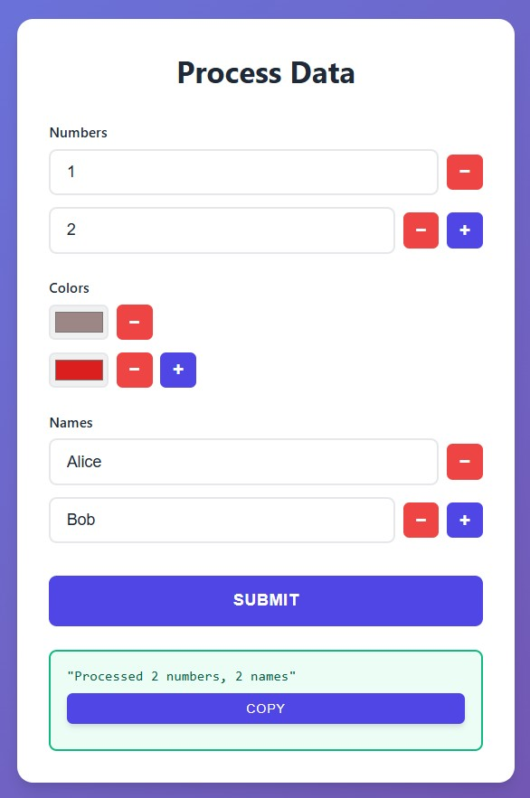

# Lists

<div class="grid" markdown>

<div markdown>

## Basic Usage
Create dynamic lists of any type with add/remove buttons.
```python
from func_to_web import run
from func_to_web.types import Color, Email

def process_data(
    # Basic type lists
    numbers: list[int],                      # List of integers
    colors: list[Color],                     # List of color pickers
    names: list[str] = ["Alice", "Bob"],     # List with defaults
):
    return f"Processed {len(numbers)} numbers, {len(names)} names"

run(process_data)
```
## Key Features
- **Dynamic add/remove buttons** for each list
- Works with **all types**: `int`, `float`, `str`, `bool`, `date`, `time`, `Color`, `Email`, Files Types
- Not supported with `Literal`
- Default values: `list[str] = ["hello", "world"]`
- All non-optional lists require at least 1 item

</div>

<div markdown>



</div>

</div>


## Next Steps

- [Optional Types](optional.md) - Make parameters optional
- [Dropdowns](dropdowns.md) - Use dropdown menus for inputs