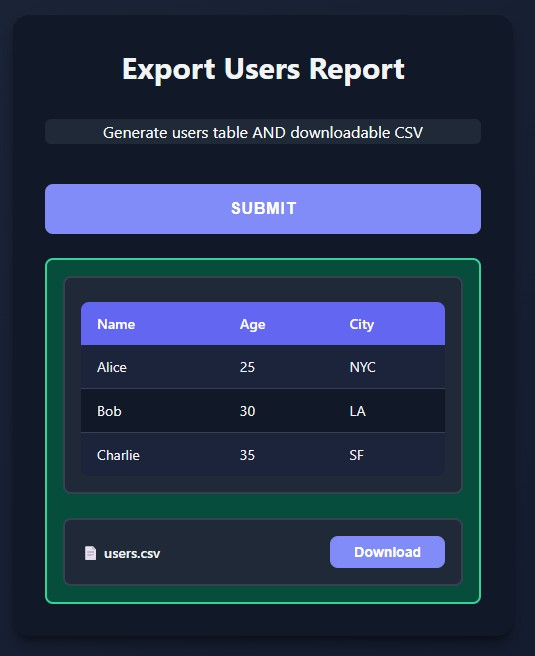

# Multiple Outputs

Return multiple outputs at once - combine text, images, plots, tables, and files in a single response.

## Basic Usage

<div class="grid" markdown>

<div markdown>

Return a tuple or list with mixed types:
```python
from func_to_web import run
from func_to_web.types import FileResponse, ImageFile
from PIL import Image, ImageFilter
import matplotlib.pyplot as plt
import numpy as np

def analyze_image(image: ImageFile, blur_radius: int = 5):
    """Process image and return multiple outputs"""
    
    # Process image
    img = Image.open(image)
    blurred = img.filter(ImageFilter.GaussianBlur(blur_radius))
    
    # Create plot
    fig, ax = plt.subplots(figsize=(8, 4))
    x = np.linspace(0, 10, 100)
    y = np.sin(x)
    ax.plot(x, y)
    ax.set_title('Sample Plot')
    ax.grid(True)
    
    # Generate data table
    analysis_data = [
        {"metric": "Width", "value": img.size[0]},
        {"metric": "Height", "value": img.size[1]},
        {"metric": "Blur Radius", "value": blur_radius}
    ]
    
    # Create downloadable file
    report = FileResponse(
        data=f"Processed with blur: {blur_radius}".encode('utf-8'),
        filename="report.txt"
    )
    
    # Return everything at once
    return (
        "✓ Analysis complete!",  # Text
        blurred,                  # PIL Image
        fig,                      # Matplotlib plot
        analysis_data,            # Table (list[dict])
        report                    # File download
    )

run(analyze_image)
```

Each output is displayed in its own container, one after another.

</div>

<div markdown>


</div>

</div>

## Combining Tables and Files

<div class="grid" markdown>

<div markdown>

Tables can be included in multiple outputs alongside other types:
```python
from func_to_web import run
from func_to_web.types import FileResponse

def export_users_report():
    """Generate users table AND downloadable CSV"""
    
    users = [
        {"name": "Alice", "age": 25, "city": "NYC"},
        {"name": "Bob", "age": 30, "city": "LA"},
        {"name": "Charlie", "age": 35, "city": "SF"}
    ]
    
    # Generate CSV
    csv_lines = ["name,age,city"]
    for user in users:
        csv_lines.append(f"{user['name']},{user['age']},{user['city']}")
    csv_content = "\n".join(csv_lines)
    
    csv_file = FileResponse(
        data=csv_content.encode('utf-8'),
        filename="users.csv"
    )
    
    return (
        users,                    # Table display
        csv_file                  # Download button
    )

run(export_users_report)
```

Perfect for reports where you want to view AND download data.

</div>

<div markdown>



</div>

</div>

## Supported Output Types

You can combine any of these in a tuple or list:

- **Text**: Plain strings are displayed as formatted text
- **PIL Images**: Automatically rendered inline
- **Matplotlib Figures**: Converted to images and displayed
- **Tables**: `list[dict]` or `list[tuple]` rendered as HTML tables
- **File Downloads**: Show download buttons with filenames
- **Multiple Files**: Lists of `FileResponse` objects

## How It Works

- Return a **tuple** or **list** from your function
- Each item is processed according to its type
- All outputs are displayed sequentially in the UI
- Each output gets its own styled container
- Works with any combination of types

## Limitations

- **No nesting**: Tuples/lists cannot contain other tuples/lists (except valid tables)
- **Valid**: `return (table_data, file)` where `table_data` is `list[dict]`
- **Invalid**: `return (("text", img), file)` - nested tuples not allowed
- **Solution**: Flatten to `return ("text", img, file)`

## Key Points

- **Flexible**: Mix text, images, plots, tables, and files freely
- **Simple syntax**: Just return a tuple or list
- **Clean UI**: Each output in its own styled box
- **No configuration**: Works automatically with existing types
- **Tables included**: `list[dict]` or `list[tuple]` are automatically detected

## What's Next?

You've completed all **Output Types**! Explore additional features.

**Next category:**

- [Function Descriptions](function-descriptions.md) - Display docstrings in the UI
- [Multiple Functions](multiple.md) - Serve multiple functions at once
- [Dark Mode](dark-mode.md) - Automatic theme switching
- [Server Configuration](server-configuration.md) - Customize server settings