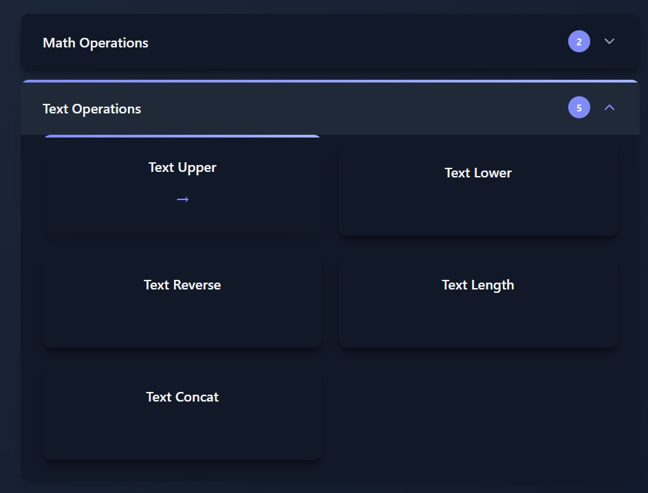

# Multiple Functions & Groups

Serve multiple functions with an auto-generated index page, optionally organized into collapsible groups.

## Multiple Functions

<div class="grid" markdown>

<div markdown>

Pass a list of functions to create an index page:
```python
from func_to_web import run

def calculate_bmi(weight_kg: float, height_m: float):
    """Calculate Body Mass Index"""
    return f"BMI: {weight_kg / (height_m ** 2):.2f}"

def celsius_to_fahrenheit(celsius: float):
    """Convert Celsius to Fahrenheit"""
    return f"{celsius}°C = {(celsius * 9/5) + 32}°F"

def reverse_text(text: str):
    """Reverse a string"""
    return text[::-1]

run([calculate_bmi, celsius_to_fahrenheit, reverse_text])
```

</div>

<div markdown>


</div>

</div>

## Grouped Functions

<div class="grid" markdown>

<div markdown>

Pass a dictionary to organize functions into collapsible groups:
```python
from func_to_web import run

def add(a: int, b: int):
    return a + b

def multiply(a: int, b: int):
    return a * b

def upper(text: str):
    return text.upper()

def lower(text: str):
    return text.lower()

run({
    'Math': [add, multiply],
    'Text': [upper, lower]
})
```

Groups display as accordion cards - only one open at a time.

</div>

<div markdown>



</div>

</div>

## Next Steps

- [Authentication](authentication.md) - Password-protect your web apps
- [Dark Mode](dark-mode.md) - Automatic theme switching
- [Server Configuration](server-configuration.md) - Customize host, port, and templates