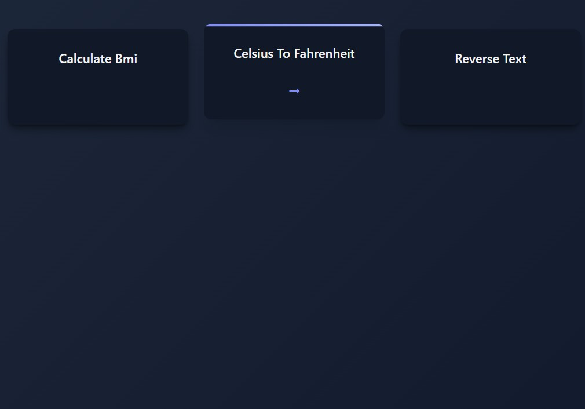

# Multiple Functions

Serve multiple functions simultaneously with an auto-generated index page.

<div class="grid" markdown>

<div markdown>

Pass a list of functions to `run()` and func-to-web creates a responsive index page:

```python
from func_to_web import run

def calculate_bmi(weight_kg: float, height_m: float):
    """Calculate Body Mass Index"""
    bmi = weight_kg / (height_m ** 2)
    return f"BMI: {bmi:.2f}"

def celsius_to_fahrenheit(celsius: float):
    """Convert Celsius to Fahrenheit"""
    fahrenheit = (celsius * 9/5) + 32
    return f"{celsius}°C = {fahrenheit}°F"

def reverse_text(text: str):
    """Reverse a string"""
    return text[::-1]

# Pass a list of functions to create an index page
run([calculate_bmi, celsius_to_fahrenheit, reverse_text])
```

Users can select which tool they want to use from the index.

</div>

<div markdown>



</div>

</div>

## How It Works

- Pass a **list of functions** instead of a single function
- An **index page** is automatically generated
- Users can **navigate between functions** easily
- Each function gets its own page with a dedicated form

## Next Steps

- [Dark Mode](dark-mode.md) - Automatic theme switching
- [Server Configuration](server-configuration.md) - Customize host, port, and templates
