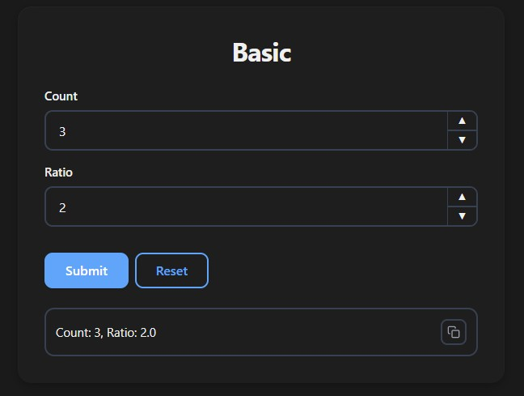
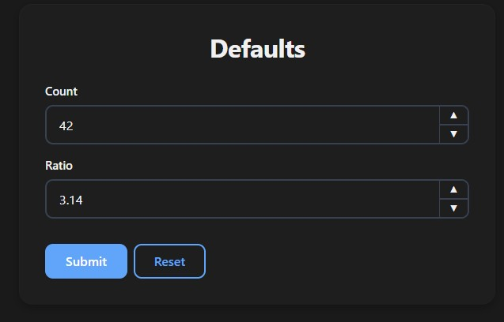
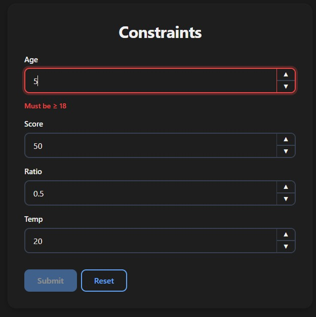
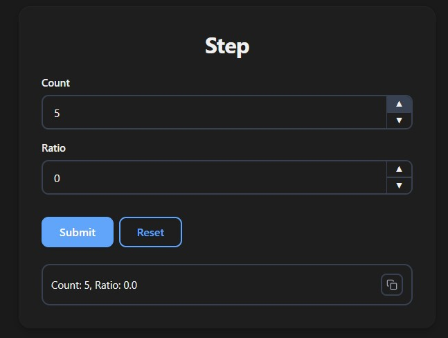
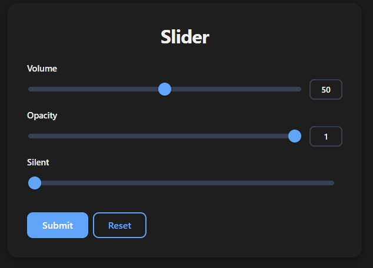
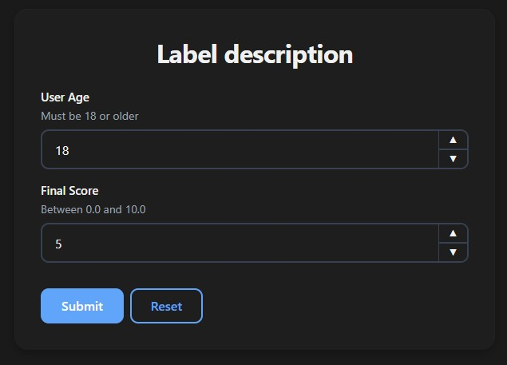
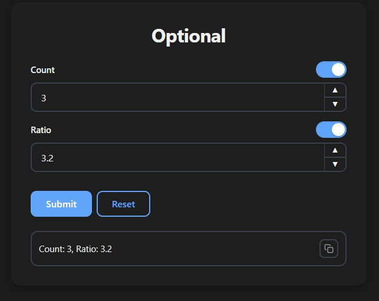
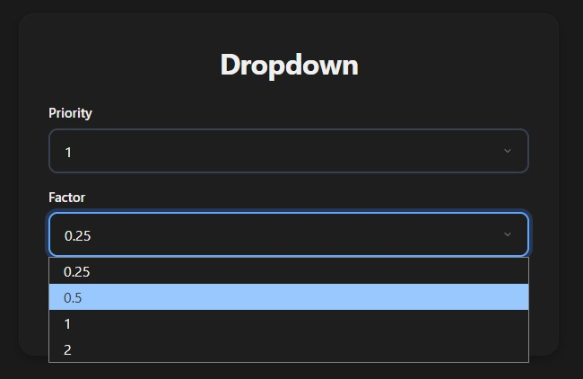
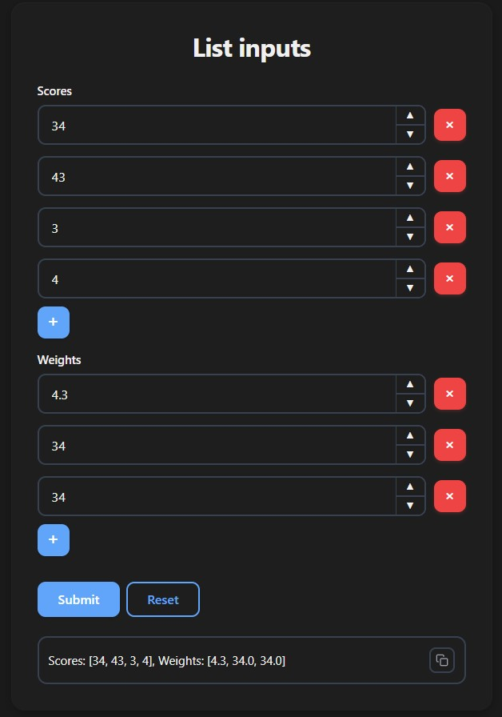

# Numeric Inputs

Use `int` for whole numbers and `float` for decimal numbers. Both render as numeric inputs with step buttons.

## Basic Usage

```python
from func_to_web import run

def basic(count: int, ratio: float):
    return f"Count: {count}, Ratio: {ratio}"

run(basic)
```



## Default Value

```python
from func_to_web import run

def defaults(count: int = 42, ratio: float = 3.14):
    return f"Count: {count}, Ratio: {ratio}"

run(defaults)
```



## Constraints

```python
from typing import Annotated
from pydantic import Field
from func_to_web import run

def constraints(
    age:    Annotated[int,   Field(ge=18, le=120)],    # 18 to 120
    score:  Annotated[int,   Field(ge=0)] = 50,        # Min 0
    ratio:  Annotated[float, Field(ge=0.0, le=1.0)],   # 0.0 to 1.0
    temp:   Annotated[float, Field(gt=-273.15)],       # Above absolute zero
):
    return f"Age: {age}, Score: {score}, Ratio: {ratio}, Temp: {temp}"

run(constraints)
```

| Constraint | Meaning                   |
|------------|---------------------------|
| `ge`       | Greater than or equal (≥) |
| `le`       | Less than or equal (≤)    |
| `gt`       | Greater than (>)          |
| `lt`       | Less than (<)             |



## Step

Controls the increment/decrement step of the input. For `float`, use decimal steps:

```python
from typing import Annotated
from func_to_web import run
from func_to_web.types import Step

def step(
    count: Annotated[int,   Step(5)]   = 0,    # Steps of 5
    ratio: Annotated[float, Step(0.1)] = 0.0,  # Steps of 0.1
):
    return f"Count: {count}, Ratio: {ratio}"

run(step)
```



## Slider

Requires `ge` and `le` to define the range:

```python
from typing import Annotated
from pydantic import Field
from func_to_web import run
from func_to_web.types import Slider

def slider(
    volume:  Annotated[int,   Field(ge=0, le=100),       Slider()] = 50,
    opacity: Annotated[float, Field(ge=0.0, le=1.0),     Slider()] = 1.0,
    silent:  Annotated[int,   Field(ge=0, le=100),       Slider(show_value=False)] = 0,
):
    return f"Volume: {volume}, Opacity: {opacity}"

run(slider)
```

`Slider(show_value=False)` hides the numeric label next to the slider.



## Label & Description

```python
from typing import Annotated
from func_to_web import run
from func_to_web.types import Label, Description

def label_description(
    age:   Annotated[int,   Label("User Age"),    Description("Must be 18 or older")] = 18,
    score: Annotated[float, Label("Final Score"), Description("Between 0.0 and 10.0")] = 5.0,
):
    return f"Age: {age}, Score: {score}"

run(label_description)
```




## Optional

```python
from func_to_web import run

def optional(count: int | None = None, ratio: float | None = None):
    return f"Count: {count}, Ratio: {ratio}"

run(optional)
```

> For full control over the toggle's initial state (`OptionalEnabled` / `OptionalDisabled`), see [Optional Types](optional.md).



## Dropdown

```python
from typing import Literal
from func_to_web import run

def dropdown(
    priority: Literal[1, 2, 3],
    factor:   Literal[0.25, 0.5, 1.0, 2.0],
):
    return f"Priority: {priority}, Factor: {factor}"

run(dropdown)
```

> For dynamic options and Enum dropdowns, see [Dropdowns](dropdowns.md).



## List

```python
from func_to_web import run

def list_inputs(scores: list[int], weights: list[float]):
    return f"Scores: {scores}, Weights: {weights}"

run(list_inputs)
```



> For list constraints and more, see [Lists](lists.md).