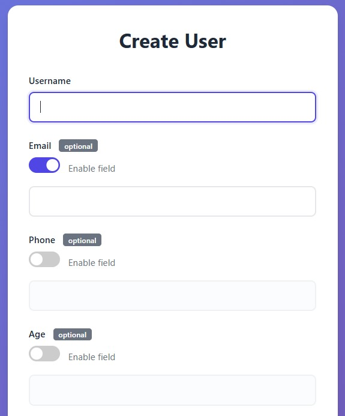

# Optional Types

<div class="grid" markdown>

<div markdown>

```python
from func_to_web import run
from func_to_web.types import OptionalEnabled, OptionalDisabled, Email

def create_user(
    username: str,  # Required field

    # Explicit control
    email: Email | OptionalEnabled,  # Always starts enabled
    phone: str | OptionalDisabled,  # Always starts disabled

    # Automatic behavior (standard Python syntax)
    age: int | None = None,  # Disabled (no default value)
    city: str | None = "Madrid",  # Enabled (has default value)

    # Explicit control with default
    bio: str | OptionalDisabled = "Dev",  # Disabled despite default
):
    result = f"Username: {username}"
    if age:
        result += f", Age: {age}"
    if city:
        result += f", City: {city}"
    if email:
        result += f", Email: {email}"
    if phone:
        result += f", Phone: {phone}"
    if bio:
        result += f", Bio: {bio}"
    return result

run(create_user)
```

</div>

<div markdown>



</div>

</div>

## How It Works

- Optional fields display a **toggle switch** to enable/disable them
- **Automatic mode** (`Type | None`): Enabled if has default value, disabled if no default
- **Explicit mode** (`Type | OptionalEnabled/OptionalDisabled`): You control the initial state, overriding defaults
- Disabled fields automatically send `None` to your function
- Works with all field types and constraints (including lists!)

## Next Steps

- [Dropdowns](dropdowns.md) - Use dropdown menus for inputs