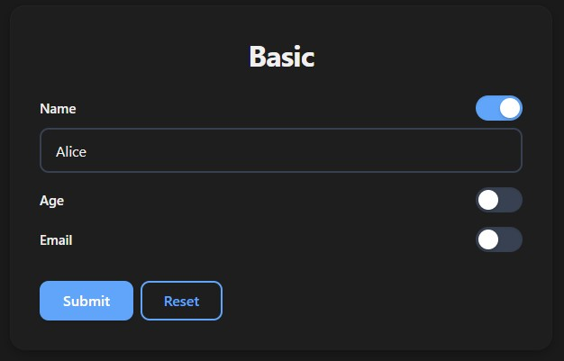
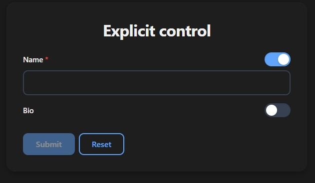
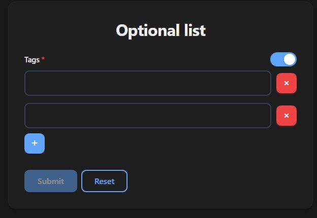

# Optional Types

Optional fields render with a toggle switch. When disabled, the field is hidden and your function receives `None`.

## Basic Usage

Use `Type | None` to make a field optional. The initial toggle state is decided automatically:

- **Toggle ON** — field has a default value
- **Toggle OFF** — field has no default value

```python
from func_to_web import run

def basic(
    name:  str | None = "Alice",  # Toggle starts ON (has default)
    age:   int | None = None,     # Toggle starts OFF (None default)
    email: str | None,            # Toggle starts OFF (no default)
):
    return f"Name: {name}, Age: {age}, Email: {email}"

run(basic)
```



## Explicit Control

Use `OptionalEnabled` or `OptionalDisabled` to override the automatic behavior regardless of the default value:

```python
from func_to_web import run
from func_to_web.types import OptionalEnabled, OptionalDisabled

def explicit_control(
    name:  str | OptionalEnabled,           # Toggle starts ON (no default)
    bio:   str | OptionalDisabled = "Dev",  # Toggle starts OFF (despite having default)
):
    return f"Name: {name}, Bio: {bio}"

run(explicit_control)
```

> `OptionalEnabled` and `OptionalDisabled` are `None` at runtime — they only affect the initial toggle state in the UI.



## Works with All Types

```python
from datetime import date
from func_to_web import run
from func_to_web.types import Color, Email, ImageFile

def all_types(
    count:   int         | None = None,
    ratio:   float       | None = None,
    flag:    bool        | None = None,
    tag:     str         | None = None,
    mail:    Email       | None = None,
    color:   Color       | None = None,
    photo:   ImageFile   | None = None,
    day:     date        | None = None,
):
    return "All optional"

run(all_types)
```

## Optional Lists

```python
from func_to_web import run

def optional_list(tags: list[str] | None = None):
    return f"Tags: {tags}"

run(optional_list)
```



## Handling None in Your Function

When a toggle is disabled, your function receives `None` — always check before using the value:

```python
from func_to_web import run

def handling_none(age: int | None = None, name: str | None = "Alice"):
    result = f"Name: {name or 'unknown'}"
    if age is not None:
        result += f", Age: {age}"
    return result

run(handling_none)
```