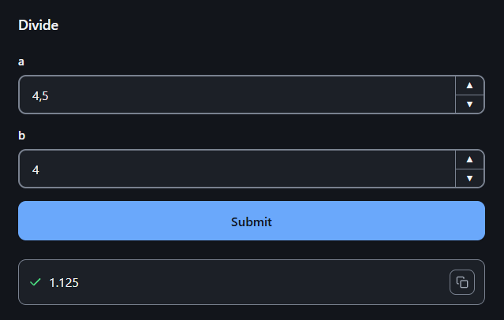
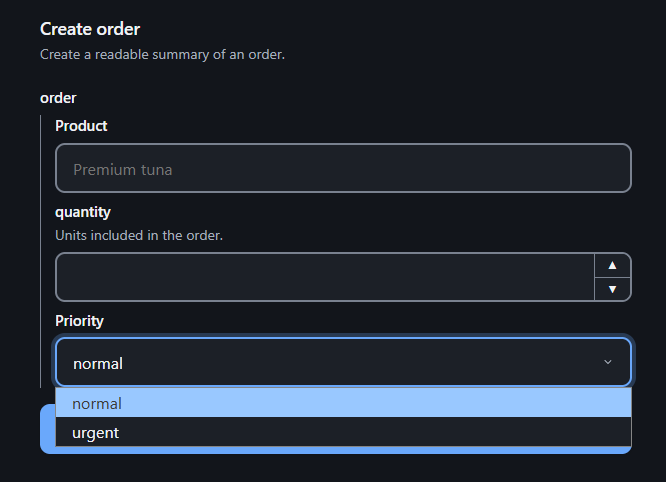

# Overview

`run(divide)` is already a web application at <http://127.0.0.1:8000>: a form
for `a` and `b`, validation of both, and the result or the error on the same
page.



## One function, four ways to use it

The function you wrote is, at the same time:

- **a form**, at `/divide/`;
- **an HTTP endpoint**, for scripts, services and agents:

  ```bash
  curl -X POST -H "Content-Type: application/json" \
    -d '{"a": 10, "b": 2}' http://127.0.0.1:8000/divide/invoke
  # {"result": {"type": "text", "value": "5.0"}}
  ```

- **a published contract**, in plain text at `/doc`, that tells a person or an
  agent how to call every function;
- **a modal in your own frontend**, opened with one line of `sdk.js`.

It can run on its own with `run()`, or be mounted inside an existing FastAPI
application with `app_of()`. See [Getting started](getting-started.md).

## How it works

Your code does not change: no base classes, no decorators, no models. FuncToWeb
reads the signature, and the type hints are the contract.

```python
from dataclasses import dataclass
from typing import Annotated

from func_to_web import Choices, Label, Max, Min, run


@dataclass
class Order:
    product: Annotated[str, Label("Product")]
    quantity: Annotated[int, Min(1), Max(100)]
    priority: Annotated[str, Choices(values=("normal", "urgent"))] = "normal"


def create_order(order: Order) -> str:
    """Create a readable summary of an order."""
    return f"{order.quantity} × {order.product} ({order.priority})"


run(create_order)
```



The form, the validation and `/doc` all come from that one definition, so adding
a field to `Order` updates all three. The function only runs with valid values:
`quantity` is always an `int` between 1 and 100.

Underneath there are three layers:
[pytypehint](https://offerrall.github.io/pytypehint/) compiles the signature and
validates, [pytypehintweb](https://offerrall.github.io/pytypehintweb/) turns it
into the form, and FuncToWeb adds the routes, the execution, the files and
`/doc`. Everything a function needs is imported from `func_to_web`.

## What else it does

- **Files**: a file parameter arrives as the path of a file already on disk.
  See [Files](files.md).
- **Outputs**: return text, images, tables or files to download. See
  [Outputs](outputs.md).
- **Progress**: what the function prints appears on the page while it runs.
  See [HTTP API](http.md#streaming).
- **Forms that lead to forms**: open a form with values already filled in, or
  make one function open another. See [Prefill and OpenForm](prefill.md).

## When to use it

FuncToWeb is for internal tools: admin tasks, scripts your team runs, small
applications on top of existing code. Unlike Gradio or Streamlit, it never
wraps your function or turns your script into an app: the same function is
imported, tested and called as if the library were not there, and it runs
under the authentication and routing of the FastAPI application you mount it
in.

The whole stack is small: Starlette and Uvicorn carry the HTTP, and the two
pytypehint layers the contract. There is no pydantic, no template engine and
no build step.

<details>
<summary>How it works inside</summary>

Each function is compiled once, when the application is built: its schema
(pytypehint's `Signature`), its plan (the form the browser draws and `/doc`
publishes) and its base HTML. A definition that does not hold fails at startup,
never on a request.

```text
GET  /{slug}/          the base HTML, or one built for a prefill
POST /{slug}/invoke    decode() → schema.build() → the function → outputs
```

`decode()` reads the JSON transport and, through FuncToWeb's file resolver,
swaps each file reference for its local path; `schema.build()` validates and
builds the arguments. FuncToWeb validates nothing on its own.

The public API is what `func_to_web` exports, plus the `schema`, `plan` and
`html` of a `WebFunction`. `WebFunction.return_parser` and
`WebFunctions.forms` are visible because the application needs them, but they
are internal state, not API.

</details>
