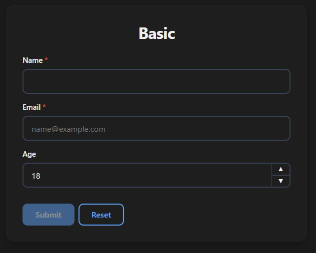
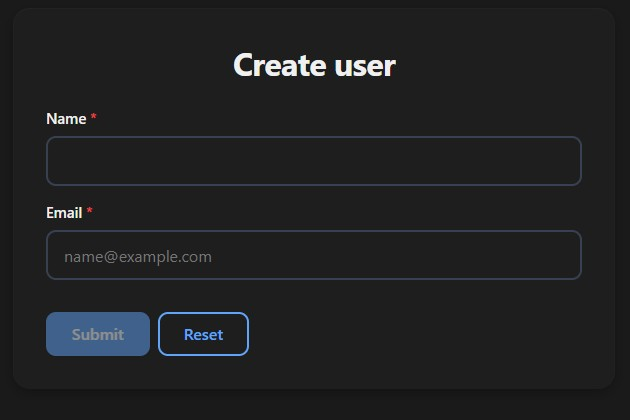
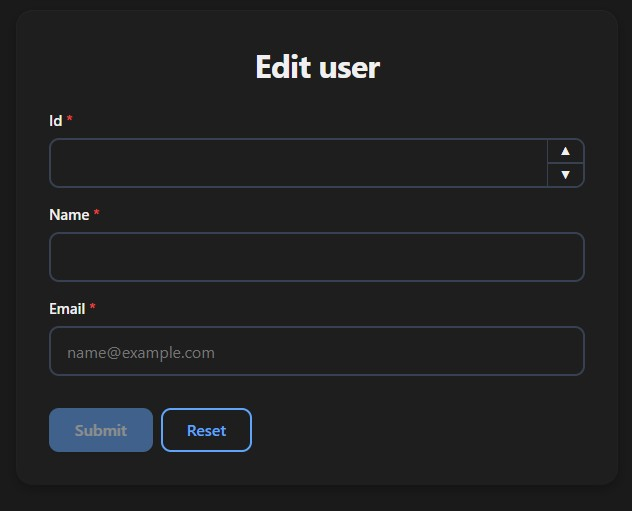
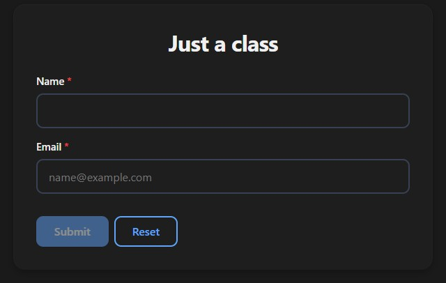

# Params

`Params` is a plain Python class — no magic, no metaclass, no Pydantic. Just a base class that tells FuncToWeb to expand its fields into the form automatically.

## Basic Usage

```python
from typing import Annotated
from pydantic import Field
from func_to_web import run, Params
from func_to_web.types import Email

class UserData(Params):
    name:  Annotated[str, Field(min_length=2, max_length=50)]
    email: Email
    age:   int = 18

def basic(data: UserData):
    return f"Created: {data.name}, {data.email}, {data.age}"

run(basic)
```

FuncToWeb expands `UserData` into three individual form fields — `name`, `email`, and `age` — exactly as if you had declared them directly on the function.



## Reusing Across Functions

The main use case for `Params` is sharing the same fields across multiple functions without repeating yourself:

```python
from typing import Annotated
from pydantic import Field
from func_to_web import run, Params
from func_to_web.types import Email

class UserData(Params):
    name:  Annotated[str, Field(min_length=2, max_length=50)]
    email: Email

def create_user(data: UserData):
    return f"Created: {data.name}"

def edit_user(id: int, data: UserData):
    return f"Edited user {id}: {data.name}"

run([create_user, edit_user])
```

Change `UserData` once and it updates every function that uses it.




## It's Just a Class

`Params` subclasses are plain Python classes. You can add methods, properties, class variables, or any logic you want:

```python
from func_to_web import run, Params
from func_to_web.types import Email

class UserData(Params):
    name:  str
    email: Email

    @property
    def display(self):
        return f"{self.name} <{self.email}>"

def just_a_class(data: UserData):
    return f"Created: {data.display}"

run(just_a_class)
```

FuncToWeb only reads the **type-annotated fields** — everything else is ignored by the form renderer.



## Mixing Params with Other Parameters

```python
from typing import Annotated
from pydantic import Field
from func_to_web import run, Params

class Address(Params):
    street: str
    city:   str
    zip:    Annotated[str, Field(pattern=r'^\d{5}$')]

def mixing(user_id: int, address: Address, notify: bool = True):
    return f"User {user_id} registered at {address.city}"

run(mixing)
```

## Default Values

Default values work exactly as in any Python class:

```python
from func_to_web import run, Params

class Settings(Params):
    theme:    str = "dark"
    language: str = "en"
    retries:  int = 3

def defaults(settings: Settings):
    return f"Theme: {settings.theme}, Lang: {settings.language}"

run(defaults)
```