# String Input

Use `str` for text inputs. Renders as a single-line text input by default.

## Basic Usage

```python
from func_to_web import run

def basic(name: str):
    return f"Hello, {name}!"

run(basic)
```

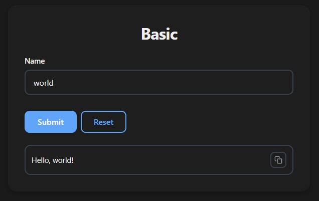

## Default Value

```python
from func_to_web import run

def defaults(name: str = "World"):
    return f"Hello, {name}!"

run(defaults)
```

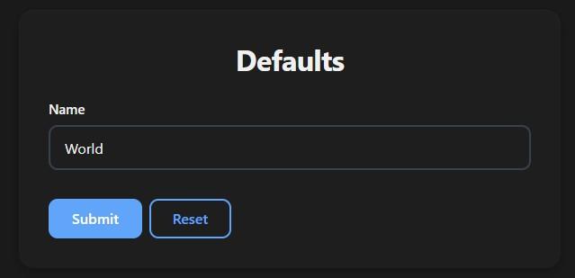

## Constraints

```python
from typing import Annotated
from pydantic import Field
from func_to_web import run

def constraints(
    username: Annotated[str, Field(min_length=3, max_length=20)],
    password: Annotated[str, Field(min_length=8)],
    phone:    Annotated[str, Field(pattern=r'^\+?[0-9]{10,15}$')],
    bio:      Annotated[str, Field(max_length=500)] = "Hello!",
):
    return f"User: {username}"

run(constraints)
```

| Constraint   | Meaning                            |
|--------------|------------------------------------|
| `min_length` | Minimum number of characters       |
| `max_length` | Maximum number of characters       |
| `pattern`    | Regex pattern the value must match |

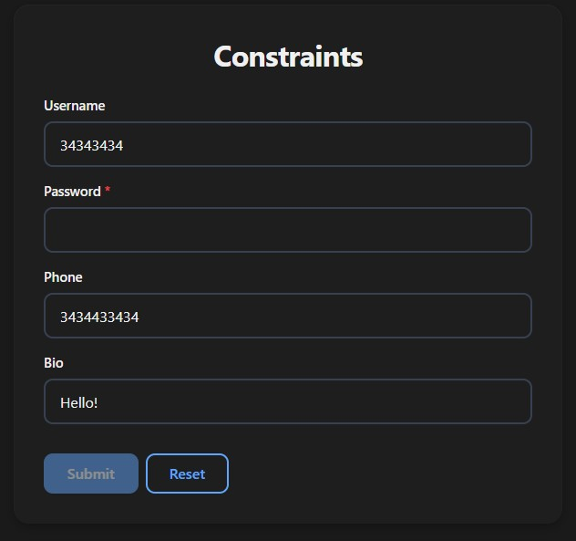

## Placeholder

```python
from typing import Annotated
from func_to_web import run
from func_to_web.types import Placeholder

def placeholder(name: Annotated[str, Placeholder("e.g. John Doe")]):
    return f"Hello, {name}!"

run(placeholder)
```

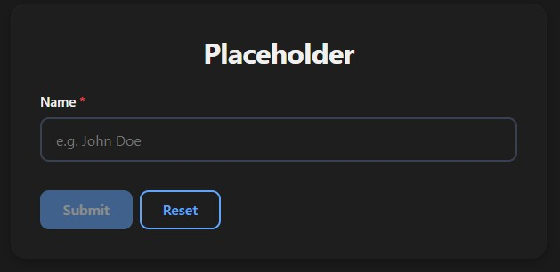

## Pattern Message

Customize the error message shown when the pattern constraint fails:

```python
from typing import Annotated
from pydantic import Field
from func_to_web import run
from func_to_web.types import PatternMessage

def pattern_message(
    phone: Annotated[
        str,
        Field(pattern=r'^\+?[0-9]{10,15}$'),
        PatternMessage("Enter a valid phone number (e.g. +34612345678)")
    ]
):
    return f"Phone: {phone}"

run(pattern_message)
```

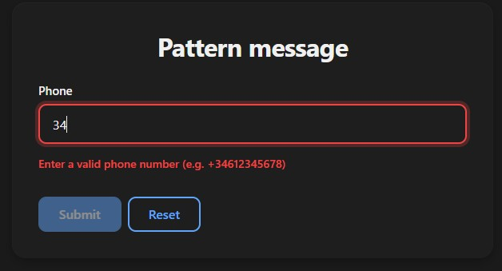

## Password

Render as a password input with a show/hide toggle:

```python
from typing import Annotated
from func_to_web import run
from func_to_web.types import IsPassword

def password(pw: Annotated[str, IsPassword()]):
    return f"Password received"

run(password)
```

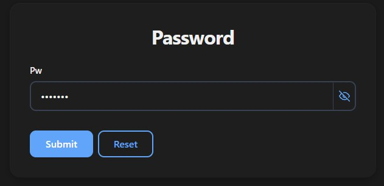

## Textarea

Render as a multiline text input:

```python
from typing import Annotated
from func_to_web import run
from func_to_web.types import Rows

def textarea(message: Annotated[str, Rows(5)]):
    return f"Message: {message}"

run(textarea)
```

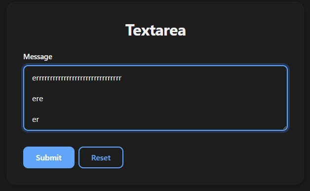

## Label & Description

```python
from typing import Annotated
from func_to_web import run
from func_to_web.types import Label, Description

def label_description(
    name: Annotated[str, Label("Full Name"), Description("Enter your first and last name")],
):
    return f"Hello, {name}!"

run(label_description)
```

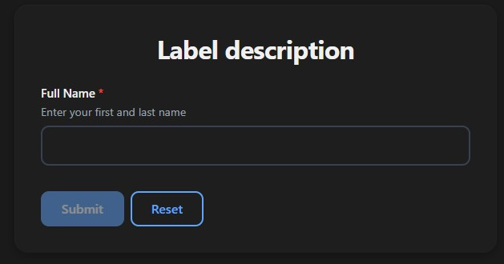

## Email

`Email` is a ready-made string type with built-in pattern validation and placeholder:

```python
from func_to_web import run
from func_to_web.types import Email

def email(contact: Email):
    return f"Email: {contact}"

run(email)
```

Works like any `str` — you can combine it with `Label`, `Description`, `Optional`, `List`, etc.

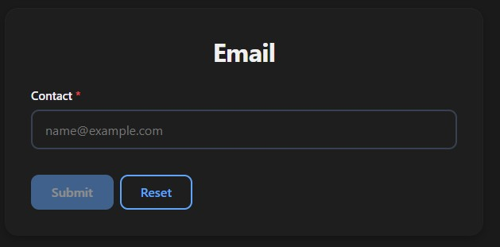

## Optional

```python
from func_to_web import run

def optional(name: str | None = None):
    return f"Hello, {name or 'stranger'}!"

run(optional)
```

> For full control over the toggle's initial state (`OptionalEnabled` / `OptionalDisabled`), see [Optional Types](optional.md).

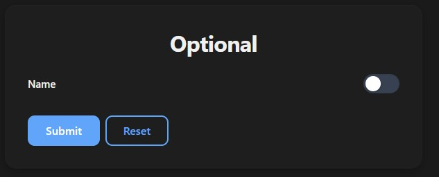

## Dropdown

```python
from typing import Literal
from func_to_web import run

def dropdown(language: Literal["en", "es", "fr"]):
    return f"Language: {language}"

run(dropdown)
```

> For dynamic options and Enum dropdowns, see [Dropdowns](dropdowns.md).

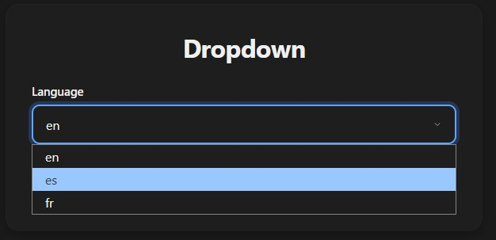

## List

```python
from func_to_web import run

def list_inputs(tags: list[str]):
    return f"Tags: {', '.join(tags)}"

run(list_inputs)
```

> For list constraints and more, see [Lists](lists.md).

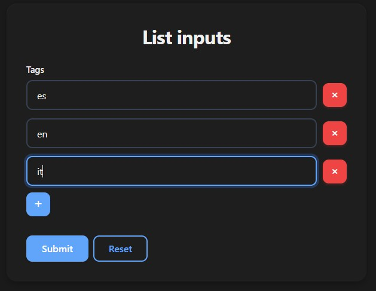
