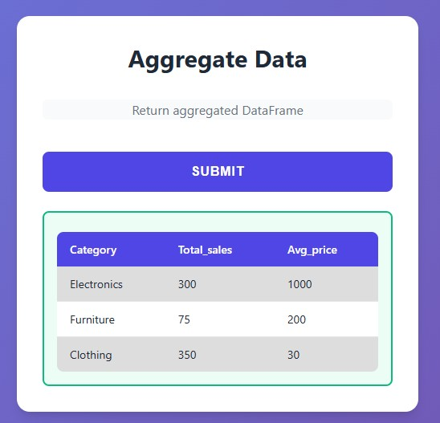
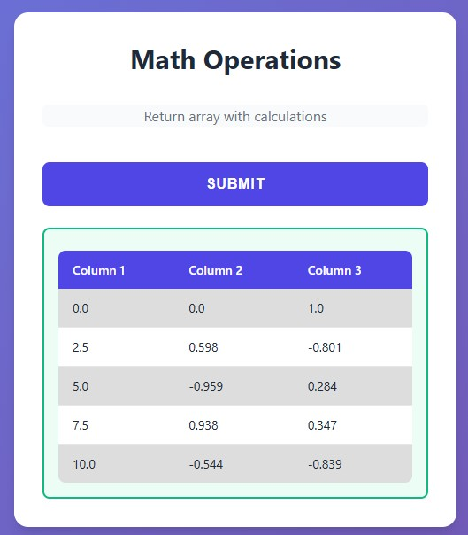

# Tables

Return tabular data from your functions and get automatic HTML table rendering.

## Basic Usage - Native Python

<div class="grid" markdown>

<div markdown>

Return a list of dictionaries or tuples:
```python
from func_to_web import run

def get_users():
    """Return list of dicts - renders as table"""
    return [
        {"name": "Alice", "age": 25, "city": "NYC"},
        {"name": "Bob", "age": 30, "city": "LA"},
        {"name": "Charlie", "age": 35, "city": "SF"}
    ]

def get_sales():
    """Return list of tuples - renders as table"""
    return [
        ("Product A", 150, "$4500"),
        ("Product B", 230, "$6900"),
        ("Product C", 180, "$5400")
    ]

run([get_users, get_sales])
```

- **`list[dict]`**: Headers from dictionary keys
- **`list[tuple]`**: Auto-generated headers (Column 1, Column 2, etc.)

</div>

<div markdown>


</div>

</div>

## Pandas DataFrames

<div class="grid" markdown>

<div markdown>

Return Pandas DataFrames directly:
```python
from func_to_web import run
import pandas as pd

def analyze_sales():
    """Pandas DataFrame automatically renders as table"""
    data = {
        'product': ['Laptop', 'Mouse', 'Keyboard'],
        'sales': [150, 450, 280],
        'revenue': [149850, 13050, 22400]
    }
    return pd.DataFrame(data)

def aggregate_data():
    """Return aggregated DataFrame"""
    data = {
        'category': ['Electronics', 'Furniture', 'Clothing'],
        'total_sales': [300, 75, 350],
        'avg_price': [1000, 200, 30]
    }
    df = pd.DataFrame(data)
    return df

run([analyze_sales, aggregate_data])
```

Works with any Pandas operations: filtering, grouping, sorting, etc.

</div>

<div markdown>



</div>

</div>

## NumPy Arrays

<div class="grid" markdown>

<div markdown>

Return 2D NumPy arrays:
```python
from func_to_web import run
import numpy as np

def create_matrix():
    """2D NumPy array renders as table"""
    return np.array([
        [100, 200, 150],
        [180, 220, 190],
        [160, 210, 175]
    ])

def math_operations():
    """Return array with calculations"""
    x = np.linspace(0, 10, 5)
    data = np.column_stack([
        x,
        np.sin(x),
        np.cos(x)
    ])
    return np.round(data, 3)

run([create_matrix, math_operations])
```

Headers are auto-generated: Column 1, Column 2, Column 3, etc.

</div>

<div markdown>



</div>

</div>

## Polars DataFrames

<div class="grid" markdown>

<div markdown>

Return Polars DataFrames:
```python
from func_to_web import run
import polars as pl

def get_data():
    """Polars DataFrame renders as table"""
    data = {
        'product': ['Laptop', 'Mouse', 'Keyboard'],
        'sales': [150, 450, 280],
        'price': [999, 29, 79]
    }
    return pl.DataFrame(data)

def filter_data(min_sales: int = 200):
    """Filter and return Polars DataFrame"""
    data = {
        'product': ['A', 'B', 'C', 'D'],
        'sales': [150, 450, 280, 95]
    }
    df = pl.DataFrame(data)
    return df.filter(pl.col('sales') >= min_sales)

run([get_data, filter_data])
```

Works with Polars operations: filtering, aggregations, joins, etc.

</div>

<div markdown>


</div>

</div>

## Combining with Other Outputs

<div class="grid" markdown>

<div markdown>

Tables work seamlessly in multiple outputs:
```python
from func_to_web import run
from func_to_web.types import FileResponse

def export_report():
    """Return table + CSV download"""
    
    users = [
        {"name": "Alice", "age": 25, "city": "NYC"},
        {"name": "Bob", "age": 30, "city": "LA"}
    ]
    
    # Generate CSV
    csv = "name,age,city\n"
    for u in users:
        csv += f"{u['name']},{u['age']},{u['city']}\n"
    
    csv_file = FileResponse(
        data=csv.encode('utf-8'),
        filename="users.csv"
    )
    
    return (
        users,      # Table
        csv_file    # Download
    )

run(export_report)
```

Perfect for reports where you want to view AND download data.

</div>

<div markdown>


</div>

</div>

## Supported Formats

All these formats automatically render as HTML tables:

| Format | Example | Headers |
|--------|---------|---------|
| `list[dict]` | `[{"a": 1, "b": 2}]` | From dict keys |
| `list[tuple]` | `[(1, 2), (3, 4)]` | Auto-generated |
| Pandas DataFrame | `pd.DataFrame(data)` | From column names |
| NumPy 2D Array | `np.array([[1, 2]])` | Auto-generated |
| Polars DataFrame | `pl.DataFrame(data)` | From column names |

Note: If the table is too wide, you can resize the form from the bottom-right corner.

## Features

- **Automatic detection**: Just return the data, no configuration needed
- **Clean styling**: Zebra striping for better readability
- **Responsive**: Tables scroll horizontally on mobile
- **Dark mode support**: Adapts to theme automatically
- **Type conversion**: All cells converted to strings for display

## Key Points

- **Zero configuration**: Return tabular data, get a table
- **Multiple formats**: Native Python, Pandas, NumPy, Polars
- **Works everywhere**: Standalone or combined with other outputs
- **Readable design**: Headers, borders, and alternating row colors

## What's Next?

- [Multiple Outputs](multiple-outputs.md) - Combine tables with images, plots, and files