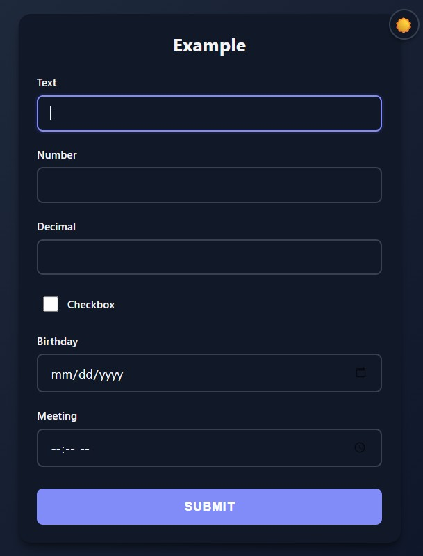

<div class="grid" markdown>

<div markdown>

```python
from func_to_web import run
from datetime import date, time

def example(
    text: str,              # Text input
    number: int,            # Integer input
    decimal: float,         # Decimal input
    checkbox: bool,         # Checkbox
    birthday: date,         # Date picker
    meeting: time           # Time picker
):
    return f"All inputs received"

run(example)
```

You can provide default values for any type:

```python
from func_to_web import run
from datetime import date, time

def create_event(
    title: str = "New Event",
    attendees: int = 1,
    duration_hours: float = 1.5,
    all_day: bool = False,
    event_date: date = date.today(),
    start_time: time = time(9, 0)
):
    return f"Event '{title}' created with {attendees} attendees"

run(create_event)
```

Default values will be pre-filled in the form fields.

</div>

<div markdown>



</div>

</div>

## Next Steps
- [File Types](files.md) - Handle file uploads easily
- [Lists](lists.md) - Learn how to use list inputs
- [Optional Types](optional.md) - Make parameters optional
- [Dropdowns](dropdowns.md) - Use dropdown menus for inputs