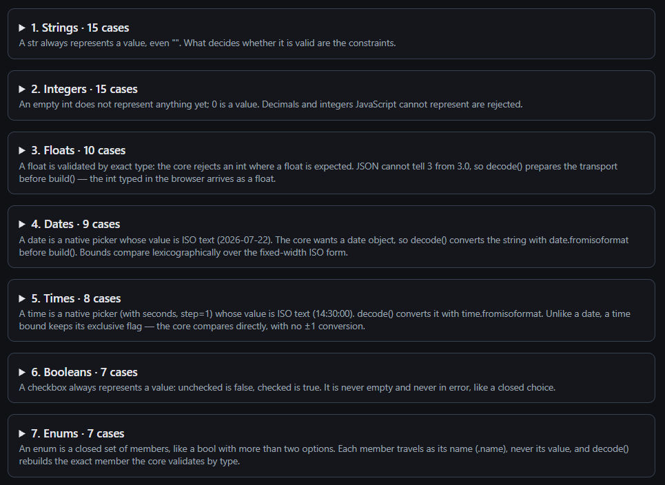

# Types and validation

The type hints are the contract: every value is validated **before** the
function runs, and the function receives real Python values.

```python
from typing import Annotated

from func_to_web import Max, Min


def percentage(value: Annotated[int, Min(0), Max(100)]) -> int:
    return value
```

`value` is always an `int` from 0 to 100: `-1`, `1.5`, `"50"` or `True` never
reach the function. Over HTTP a value that breaks the contract is a `422` with
the reason.

## What a parameter can be

| Type | In the form |
| --- | --- |
| `int`, `float`, `str`, `bool` | a number, a text, a switch |
| `date`, `time` | a date or time picker |
| an `Enum` or `Literal[...]` | a dropdown |
| `list[T]` | a list of fields, with add and remove |
| a dataclass | its fields, nested; the function gets a real instance |
| `T \| None` | the field with a toggle that decides whether it is sent |
| `A \| B` | a choice between the shapes of each branch |
| `Color`, `Email` | a `str` with a color picker, or checked as an email |
| a `str` with `FileHint` | a file picker; see [Files](files.md) |

Validation is recursive: it reaches every item of a list and every field of a
nested dataclass.

```python
def average(
    values: Annotated[list[Annotated[int, Min(0), Max(100)]], Min(1), Max(20)],
) -> float:
    return sum(values) / len(values)
```

Between 1 and 20 values, each from 0 to 100: the outer `Min`/`Max` count the
list, the inner ones check each item.

## Constraints and presentation

Everything goes inside `Annotated`, and everything is imported from
`func_to_web`.

These constrain the value:

| Atom | What it checks |
| --- | --- |
| `Min(value, exclusive=False)`, `Max(...)` | a number, date or time's bound; a text's or list's length. `exclusive=True` leaves the bound out |
| `MultipleOf(value)` | an `int` that is a multiple of `value` |
| `Choices(values=(...))` | one of a fixed set |
| `Pattern(value, message=None)` | a text matching a regular expression; `message` is the error shown |
| `FileHint(extensions=(), min_size=None, max_size=None)` | a file; see [Files](files.md) |

These only change how the field looks:

| Atom | What it does |
| --- | --- |
| `Label(value)`, `Description(value)`, `Placeholder(value)` | the field's name, its help text, and a hint inside it |
| `Step(value)` | the step of a number's arrows |
| `Slider(show_value=True)` | a slider instead of a number box |
| `Rows(value)` | a multi-line text box of that height |
| `IsPassword()` | a hidden text |
| `OptionalToggle(enabled)` | whether an `X \| None` field starts on |
| `Extra(key, value)` | a namespaced pair stored on the field, for your own code; FuncToWeb ignores it |

`Color` and `Email` are `str` with the patterns `COLOR_PATTERN` and
`EMAIL_PATTERN`, which you can also use yourself. A signature that cannot be
compiled raises `SchemaTypeError` (a wrong type) or `SchemaValueError` (a wrong
value, such as a default outside its bounds) when the application is built.

## Defaults

Defaults are checked when the application starts, and rebuilt for every call,
so a list or a dataclass used as a default is never shared between two calls:

```python
from dataclasses import dataclass


@dataclass
class Item:
    value: int


def process(items: list[Item] = [Item(1), Item(2)]) -> int:
    return sum(item.value for item in items)
```

## Every control, on screen

The widgets are pytypehintweb's, and its demo shows every one of them. Install
the `demo` extra of `pytypehintweb` and run:

```bash
pytypehintweb-demo
```



The complete catalog of types and atoms is in
[pytypehint's documentation](https://offerrall.github.io/pytypehint/).

## Limits

- Two atoms that need different controls cannot be combined: `Rows` with
  `Choices` or `IsPassword`, and `Slider` or `Choices` with `Placeholder`, or
  `Choices` with `Slider`.
- A file field takes no text atoms (`Pattern`, `Placeholder`, `Rows`...).
- An `int` beyond JavaScript's safe range (±2⁵³−1), a dataclass with no fields
  and a dataclass that contains itself are rejected when the application is
  built.
