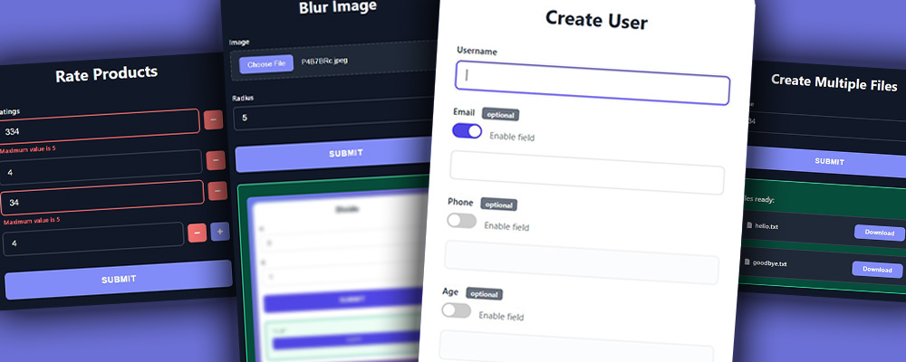
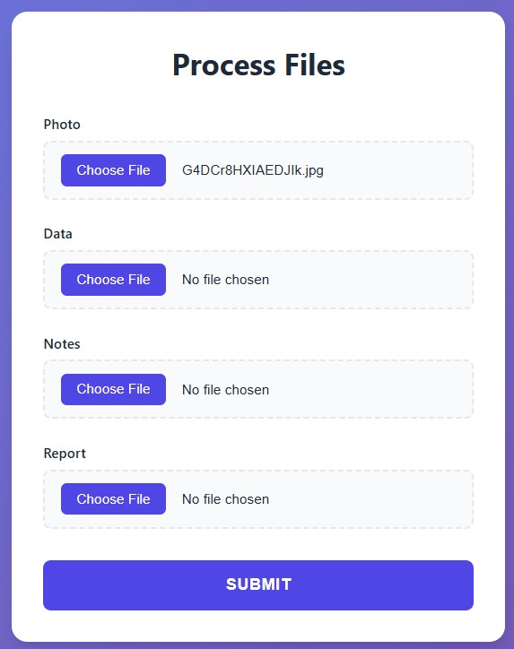

# FuncToWeb

**Transform any Python function into a web interface automatically.**

FuncToWeb is a minimalist library that generates web UIs from your Python functions with zero boilerplate. Just add type hints, call `run()`, and you're done.

**The entire library is just 350 lines of Python and 700 lines of HTML/CSS/JS.** Simple, powerful, and easy to understand.



## Quick Start (Minimal Example)

```python
from FuncToWeb import run

def divide(a: int, b: int):
    return a / b

run(divide)
```

Open `http://127.0.0.1:8000` in your browser and you'll see an auto-generated form.


## Installation

```bash
git clone https://github.com/offerrall/FuncToWeb
cd FuncToWeb
pip install .
```

## Examples

**Check the `examples/` folder** for 14+ complete, runnable examples covering everything from basic forms to image processing and data visualization. Each example is a single Python file you can run immediately:

```bash
python examples/01_basic_division.py
python examples/08_image_blur.py
python examples/11_plot_sine.py
```


## What Can You Do?

### Basic Types

All Python built-in types work out of the box:

```python
from FuncToWeb import run
from datetime import date, time

def example(
    text: str,              # Text input
    number: int,            # Integer input
    decimal: float,         # Decimal input
    checkbox: bool,         # Checkbox
    birthday: date,         # Date picker
    meeting: time           # Time picker
):
    return "All basic types supported!"

run(example)
```


### Special Input Types

```python
from FuncToWeb import run, Color, Email

def special_inputs(
    favorite_color: Color,  # Color picker
    contact: Email          # Email validation
):
    return f"Color: {favorite_color}, Email: {contact}"

run(special_inputs)
```


### File Uploads

```python
from FuncToWeb import run, ImageFile, DataFile, TextFile, DocumentFile

def process_files(
    photo: ImageFile,       # .png, .jpg, .jpeg, .gif, .webp
    data: DataFile,         # .csv, .xlsx, .xls, .json
    notes: TextFile,        # .txt, .md, .log
    report: DocumentFile,   # .pdf, .doc, .docx
):
    return "Files uploaded!"

run(process_files)
```



### Dropdowns

```python
from typing import Literal
from FuncToWeb import run

def preferences(
    theme: Literal['light', 'dark', 'auto'],
    language: Literal['en', 'es', 'fr']
):
    return f"Theme: {theme}, Language: {language}"

run(preferences)
```


### Constraints & Validation

```python
from typing import Annotated
from pydantic import Field
from FuncToWeb import run

def register(
    age: Annotated[int, Field(ge=18, le=120)],              # Min/max values
    username: Annotated[str, Field(min_length=3, max_length=20)],  # Length limits
    rating: Annotated[float, Field(gt=0, lt=5)]             # Exclusive bounds
):
    return f"User {username}, age {age}, rating {rating}"

run(register)
```


### Return Images & Plots

FuncToWeb automatically detects and displays images from PIL/Pillow and matplotlib:

```python
from FuncToWeb import run, ImageFile
from PIL import Image, ImageFilter

def blur_image(image: ImageFile, radius: int = 5):
    img = Image.open(image)
    return img.filter(ImageFilter.GaussianBlur(radius))

run(blur_image)
```


```python
from FuncToWeb import run
import matplotlib.pyplot as plt
import numpy as np

def plot_sine(frequency: float = 1.0, amplitude: float = 1.0):
    x = np.linspace(0, 10, 1000)
    y = amplitude * np.sin(frequency * x)
    
    fig, ax = plt.subplots(figsize=(10, 6))
    ax.plot(x, y)
    ax.grid(True)
    return fig

run(plot_sine)
```


## Run Multiple Functions 
You can serve multiple functions simultaneously. When passing a list of functions, FuncToWeb automatically creates a responsive index page where users can select the tool they want to use. This is demonstrated in Example 14.

```python
from FuncToWeb import run

def calculate_bmi(weight_kg: float, height_m: float):
    """Calculate Body Mass Index"""
    # ... implementation details
    return "BMI result"

def celsius_to_fahrenheit(celsius: float):
    """Convert Celsius to Fahrenheit"""
    # ... implementation details
    return "Fahrenheit result"

# Pass a list of functions to create an index page
run([calculate_bmi, celsius_to_fahrenheit, reverse_text, divide_numbers, greet])
```


## Features

### Input Types
- `int`, `float`, `str`, `bool` - Basic types
- `date`, `time` - Date and time pickers
- `Color` - Color picker with preview
- `Email` - Email validation
- `Literal[...]` - Dropdown selections
- `ImageFile`, `DataFile`, `TextFile`, `DocumentFile`, `AnyFile` - File uploads

### Validation
- **Numeric**: `ge`, `le`, `gt`, `lt` (min/max bounds)
- **String**: `min_length`, `max_length`, `pattern` (regex)
- **Required/Optional**: Automatic detection from type hints
- **Default values**: Set in function signature

### Output Types
- **Text/Numbers/Dicts** - Formatted as JSON
- **PIL Images** - Displayed as images
- **Matplotlib Figures** - Rendered as PNG
- **Any object** - Converted with `str()`

## Configuration

### One function:
```python
from FuncToWeb import run

def my_function(x: int):
    return x * 2

run(my_function, host="127.0.0.1", port=5000, template_dir="my_templates")
```
### Multiple functions:
```python
from FuncToWeb import run

def func1(x: int): return x
def func2(y: str): return y
run([func1, func2], host="127.0.0.1", port=5000, template_dir="my_templates")
```


**Parameters:**
- `func` - Single function or list of functions to serve
- `host` - Server host (default: `"0.0.0.0"`)
- `port` - Server port (default: `8000`)
- `template_dir` - Custom template directory (optional)

## How It Works

1. **Analysis** - Inspects function signature using `inspect`
2. **Validation** - Validates type hints and constraints using `pydantic`
3. **Form Generation** - Builds HTML form fields from metadata
4. **File Handling** - Saves uploaded files to temp locations
5. **Server** - Runs FastAPI server with auto-generated routes
6. **Result Processing** - Detects return type and formats accordingly
7. **Display** - Shows results as text, JSON, images, or plots

## Why FuncToWeb?

- **Minimalist** - Only 300 lines of Python + 600 lines of HTML/CSS/JS
- **Zero boilerplate** - Just type hints and you're done
- **Powerful** - Supports all common input types including files
- **Smart output** - Automatically displays images, plots, and data
- **Type-safe** - Full Pydantic validation
- **Client + server validation** - Instant feedback and robust checks
- **Batteries included** - 15+ examples in the `examples/` folder
- **Multi-function support** - Serve multiple tools from one server

## Requirements

- Python 3.8+
- FastAPI
- Uvicorn
- Pydantic
- Jinja2

Optional for examples:
- Pillow (for image processing)
- Matplotlib (for plots)

## License

MIT

## Contributing

Contributions are welcome! Please feel free to submit a Pull Request.